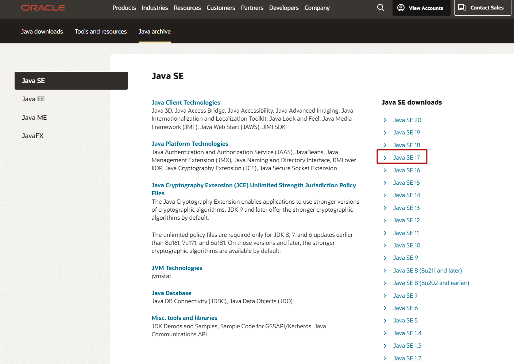
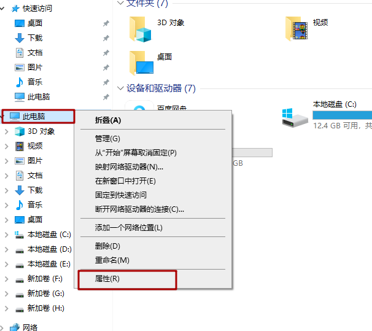
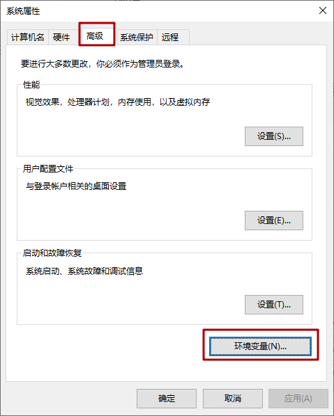
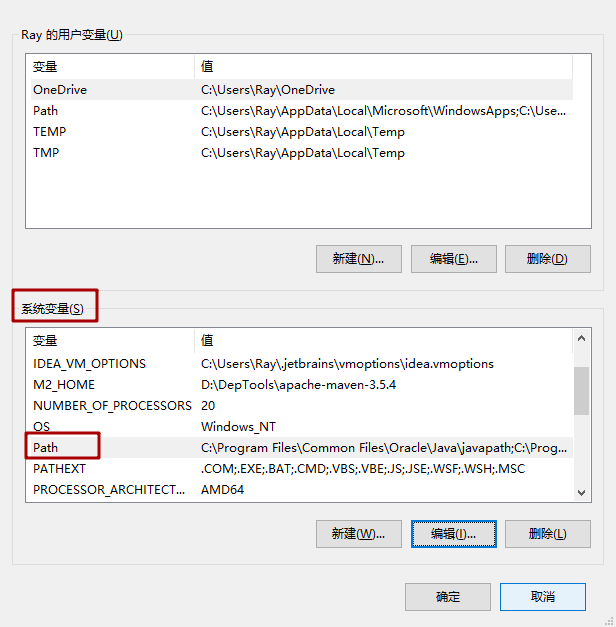
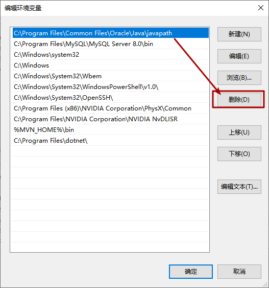
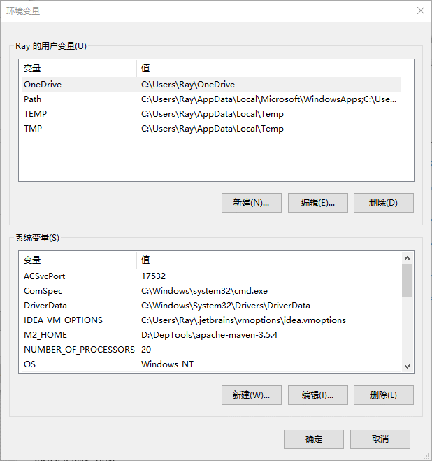
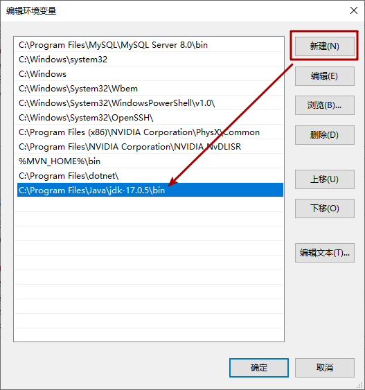
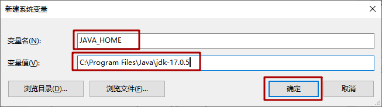
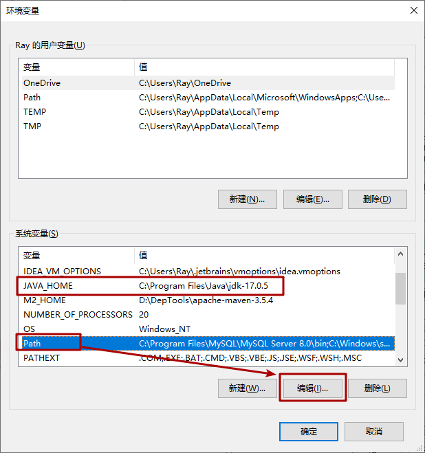
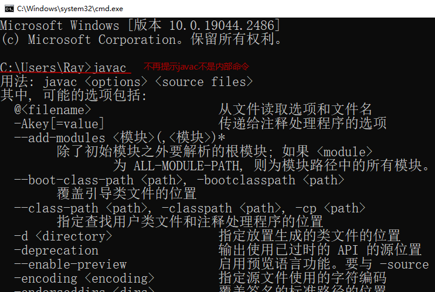

# JDK 的下载、安装与配置

## 1、下载JDK

官网网址：www.oracle.com，JDK下载地址：https://www.oracle.com/java/technologies/downloads/archive/

找到安装包，例如：安装环境是Windows系统基于x64处理器。

选择同意协议，注册或登录后下载

## 2、JDK的安装

JDK17的安装步骤很简单，一直下一步操作即可。

**安装步骤：**

* 双击`jdk-17_windows-x64_bin.exe`文件，并单击`下一步`，如图所示：

  

* 修改安装路径，单击更改，如图所示：

​	如果需要，可以单击更改按钮，将安装路径修改为`指定路径''，并单击确定

* 稍后几秒，安装完成，如图所示：

  

* 目录结构，如图所示：

## 3、 配置JDK环境变量

### 1、为什么配置环境变量path？

是希望在任意目录下都可以直接运行javac.exe、java.exe等工具。

如果没有配置环境变量path，那么就只能进入到JDK的bin目录下才能使用javac.exe、java.exe等工具，如果每次都要这样操作，那么太麻烦了。

**配置JDK环境变量就是把JDK的bin目录的路径添加到path的变量值中。**

**环境变量path的作用：操作系统会从环境变量path指定的路径下查找程序。**

1. 先看当前路径，例如：C:\Users\Ray>，下面有没有javac.exe
2. 如果没找到，就去path变量中记录的路径下找javac.exe

实际上安装JDK17时，安装程序已经默认帮我们配置了一个环境变量，我们要将其删除并重新配置。

### 2、打开环境变量配置界面

动图演示：

**详细步骤：**

1. 打开桌面上的计算机，进入后在左侧找到**计算机或此电脑**，单击鼠标右键，选择**属性**，如图所示：

  

2. 选择**高级系统设置**，如图所示：

  

3. 在**高级**选项卡，单击**环境变量**，如图所示：

  

  

4. 显示用户环境变量和系统环境变量

  **用户环境变量**配置只对当前windows用户有效，**系统环境变量**配置对所有windows用户有效。建议对系统变量进行配置。

  在**系统变量**中，点击**新建**可以创建新的环境变量；直接选择变量名，**双击或点击编辑**即可对已有的环境变量进行配置。

  例如：选中**Path** 环境变量，双击或者点击编辑 ,如图所示：

  

### 3、配置JDK环境变量

安装JDK17时，安装程序已经默认帮我们配置了一个环境变量，我们要将其删除并重新配置，因为不方便后期其他软件使用。

编辑**path变量**，然后删除默认配置的JDK环境变量

以下是两种配置方式，略有不同，建议使用第二种配置方式。

#### 方式一：只配置Path

编辑**path变量**，点击新建，键入JDK的安装目录下**bin目录**。如图所示：

#### 方式二：配置JAVA_HOME+Path（推荐）

配置这个**JAVA_HOME**的环境变量是因为后期要安装的软件IDEA，TOMCAT等也要使用此环境变量。

**动图演示：**

**详细步骤：**

1. 首先，在**系统变量**中，单击**新建** ，创建新的环境变量，如图所示：

  

  变量名输入**JAVA_HOME**，变量值输入**JDK的安装路径** ，并单击**确定**，如图所示：

  

2. 然后**，编辑Path 变量**，双击或者点击编辑path变量 ,如图所示：

  

  

  点击**新建**，键入 **%JAVA_HOME%\bin** 。如图所示：

  

  最好将其上移到最上面第一个位置

  

3. **连续点击确认**后，环境变量配置完成。

### 4、测试配置结果

注意：配置完成后，**一定要重新开启**CMD命令行窗口，在任意目录下输入`javac` 命令，显示以下结果，表示配置成功。

### 5、注意事项：

1. JDK安装路径尽量要保留JDK版本信息，比如：C:\Program Files\Java\\**jdk-17.0.5**\

2. JDK安装后会默认配置环境变量，建议删除，使用我们自己的配置

3. JDK环境变量配置推荐配置JAVA_HOME的方式

4. 配置完环境变量一定要重新打开CMD命令行测试

5. JDK环境变量配置成功重启后失效，尝试解决：配置正确的情况下，以管理员身份打开CMD命令行窗口，执行一次javac，java命令

