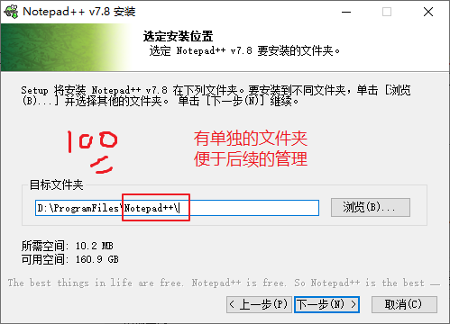
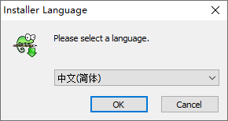

# 一、软件安装路径问题

## 1、安装路径的选择

1. **全部默认路径安装**

   此方式安装方便，不需要手动设置安装路径，但是与很多系统自带的程序混在一起安装在系统分区C盘，日积月累容易导致系统分区空间不足。

   

   

2. **统一安装到指定路径下**

   此方式方便后期维护安装的软件程序，但是每次安装一个软件都需要手动指定安装路径。

   

3. **混合方式**：

   - 需要安装才能用的软件采用默认路径安装。
   - 解压缩即可使用的软件统一解压到指定路径下。

## 2、安装目录名称

### （1）必须每一个软件，有一个自己的文件夹（目录名称）

### （2）尽量避免中文目录

### （3）尽量避免空格

如果安装软件名自带的空格，一般都还好。

最怕是手动输入空格，之前有同学就输入全角的空格，被当成中文字符识别，服务起不来。

# 二、Notepad++

Notepad++是一个文本编辑器。

## 1、界面语言的选择

## 2、路径的选择（见上面）

## 3、组件的选择

## 4、桌面快捷方式等

要是刚刚没有选择创建桌面快捷方式，可以用下面的方式发送桌面快捷方式

# 三、Typora软件

