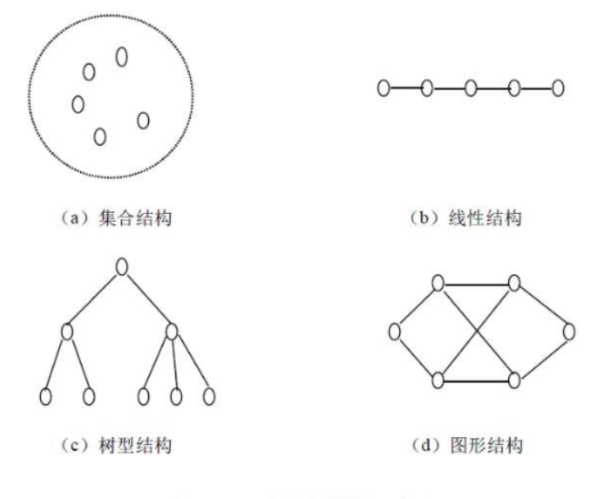
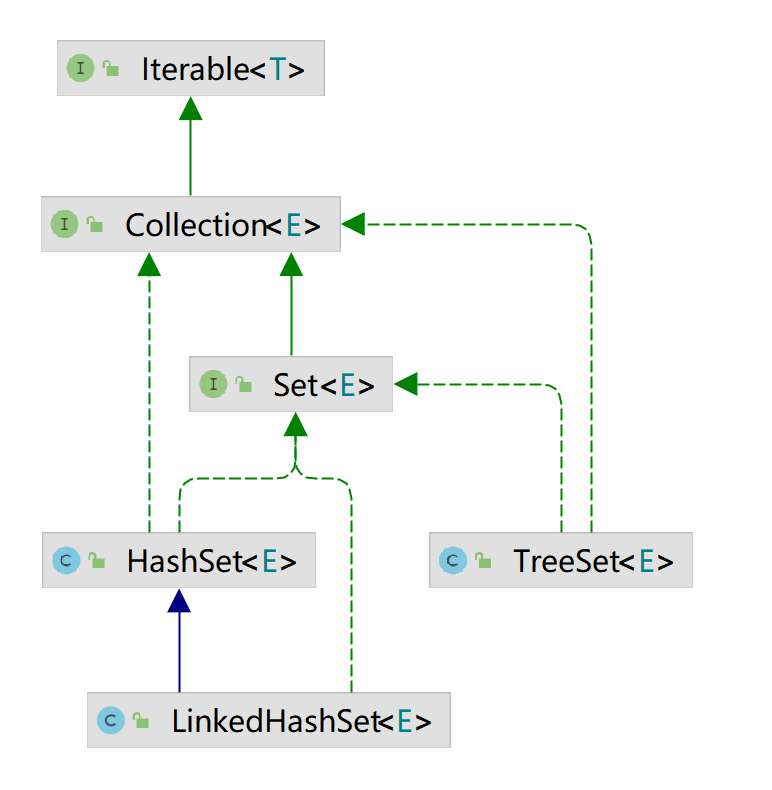

# 第11章 集合

## 主要内容

- List集合
- Set集合
- Map集合

## 学习目标

- [ ] 能够熟练使用Collection集合的API
- [ ] 能够使用Iterator迭代器遍历Collection系列的集合
- [ ] 能够使用foreach遍历Collection系列的集合
- [ ] 能够说出List集合和Set集合的区别
- [ ] 能够说出List集合各种实现类的区别
- [ ] 能够说出Set集合各种实现类的区别
- [ ] 能够说出Collection集合与Map集合的区别
- [ ] 掌握Map集合的常用API
- [ ] 能够遍历Map集合
- [ ] 能够说出Map集合各种实现类的区别

# 第十一章 集合

集合是java中提供的一种容器，可以用来存储多个对象数据。

既然有数组作为数据容器，Java为什么还提供集合容器？它们有啥区别呢？

1. 数组的长度是固定的，不利于数据的增删。集合的长度是可变的。
2. 数组中提供的属性和方法较少，不便于进行常用的增删改查操作，集合提供了更丰富的API。
3. 数组存储数据的特点单一，即有序的，可重复的。集合有很多种类型，分别有不同的存储特点。
4. 数组中可以存储基本数据类型值，也可以存储对象，而集合中只能存储对象

**集合主要分为两大系列：Collection和Map，Collection 表示一组对象，Map表示一组映射关系或键值对。**


## 11.1 Collection集合

Collection 层次结构中的根接口。Collection 表示一组对象，这些对象也称为 collection 的元素。一些 collection 允许有重复的元素，而另一些则不允许。一些 collection 是有序的，而另一些则是无序的。JDK 不提供此接口的任何直接实现：它提供更具体的子接口（如 Set 和 List、Queue）实现。此接口通常用来传递 collection，并在需要最大普遍性的地方操作这些 collection。 

Collection\<E\>是所有单列集合的父接口，因此在Collection中定义了单列集合(List和Set)通用的一些方法，这些方法可用于操作所有的单列集合。

### 11.1.1 Collection接口相关方法

#### **1、添加元素**

（1）add(E obj)：添加元素对象到当前集合中

（2）addAll(Collection<? extends E> other)：添加other集合中的所有元素对象到当前集合中，即this = this ∪ other

#### **2、删除元素**

（1） boolean remove(Object obj) ：从当前集合中删除第一个找到的与obj对象equals返回true的元素。

（2）boolean removeAll(Collection<?> coll)：从当前集合中删除所有与coll集合中相同的元素。即this = this - this ∩ coll

（3）boolean retainAll(Collection<?> coll)：从当前集合中删除两个集合中不同的元素，使得当前集合仅保留与c集合中的元素相同的元素，即当前集合中仅保留两个集合的交集；

（4） void clear(); 清空集合

#### **3、其他操作**

（1）int size()：获取当前集合中实际存储的元素个数

（2）boolean isEmpty()：判断当前集合是否为空集合。

（3）boolean contains(Object obj)：判断当前集合中是否存在一个与obj对象equals返回true的元素。

（4）boolean containsAll(Collection<?> c)：判断c集合中的元素是否在当前集合中都存在。即c集合是否是当前集合的“子集”。

（5）Object[] toArray()：返回包含当前集合中所有元素的数组

### 11.1.2 API演示

#### 1、演示添加

注意：add和addAll的区别

~~~java
package com.atguigu.collection;

import org.junit.Test;

import java.util.ArrayList;
import java.util.Collection;

public class TestCollectionAdd {
    @Test
    public void testAdd(){
        //ArrayList是Collection的子接口List的实现类之一。
        Collection<String> coll = new ArrayList();
        coll.add("王安石");
        coll.add("李白");
        coll.add("杜甫");
        System.out.println(coll);
    }

    @Test
    public void testAddAll(){
        Collection<Integer> c1 = new ArrayList();
        c1.add(1);
        c1.add(2);
        System.out.println("c1集合元素的个数：" + c1.size());//2
        System.out.println("c1 = " + c1);

        Collection<Integer> c2 = new ArrayList();
        c2.add(1);
        c2.add(2);
        System.out.println("c2集合元素的个数：" + c2.size());//2
        System.out.println("c2 = " + c2);

        Collection<Integer> other = new ArrayList();
        other.add(1);
        other.add(2);
        other.add(3);
        System.out.println("other集合元素的个数：" + other.size());//3
        System.out.println("other = " + other);
        System.out.println();

        c1.addAll(other);
        System.out.println("c1集合元素的个数：" + c1.size());//5
        System.out.println("c1.addAll(other) = " + c1);

        c2.add(other);
        System.out.println("c2集合元素的个数：" + c2.size());
        System.out.println("c2.add(other) = " + c2);
    }
}
~~~

#### 2、演示删除

注意几种删除方法的区别

```java
package com.atguigu.collection;

import org.junit.Test;

import java.util.ArrayList;
import java.util.Collection;
import java.util.function.Predicate;

public class TestCollectionRemove {
    @Test
    public void test01(){
        Collection<String> coll = new ArrayList();
        coll.add("王安石");
        coll.add("李白");
        coll.add("杜甫");
        coll.add("白居易");
        System.out.println("coll = " + coll);

        coll.remove("李白");
        System.out.println("删除元素之后coll = " + coll);

       
        coll.clear();
        System.out.println("coll清空之后，coll = " + coll);
    }

    @Test
    public void test02() {
     Collection<String> coll = new ArrayList();
        coll.add("王安石");
        coll.add("李白");
        coll.add("杜甫");
        coll.add("白居易");
        System.out.println("coll = " + coll);

        Collection<String>  other = new ArrayList();
        other.add("王安石");
        other.add("李白");
        other.add("白居易");
        System.out.println("other = " + other);

        coll.removeAll(other);
        
        System.out.println("coll.removeAll(other)之后，coll = " + coll);
        System.out.println("coll.removeAll(other)之后，other = " + other);
    }

    @Test
    public void test03() {
        Collection<String> coll = new ArrayList();
        coll.add("王安石");
        coll.add("李白");
        coll.add("杜甫");
        coll.add("白居易");
        System.out.println("coll = " + coll);

        
        Collection<String>  other = new ArrayList();
        other.add("王安石");
        other.add("李白");
        other.add("白居易");
        System.out.println("other = " + other);

        coll.retainAll(other);
        System.out.println("coll.retainAll(other)之后，coll = " + coll);
        System.out.println("coll.retainAll(other)之后，other = " + other);
    }

}
```

#### 3、演示其他操作

```java
package com.atguigu.collection;

import org.junit.Test;

import java.util.ArrayList;
import java.util.Arrays;
import java.util.Collection;

public class TestCollectionContains {
    @Test
    public void test01() {
        Collection coll = new ArrayList();
        System.out.println("coll在添加元素之前，isEmpty = " + coll.isEmpty());
        coll.add("小李广");
        coll.add("扫地僧");
        coll.add("石破天");
        coll.add("佛地魔");
        System.out.println("coll的元素个数" + coll.size());
        Object[] objects = coll.toArray();
        System.out.println("用数组返回coll中所有元素：" + Arrays.toString(objects));
        System.out.println("coll在添加元素之后，isEmpty = " + coll.isEmpty());
        coll.clear();
        System.out.println("coll在clear之后，isEmpty = " + coll.isEmpty());
    }

    @Test
    public void test02() {
        Collection coll = new ArrayList();
        coll.add("小李广");
        coll.add("扫地僧");
        coll.add("石破天");
        coll.add("佛地魔");
        System.out.println("coll = " + coll);
        System.out.println("coll是否包含“小李广” = " + coll.contains("小李广"));
        System.out.println("coll是否包含“宋红康” = " + coll.contains("宋红康"));

        Collection other = new ArrayList();
        other.add("小李广");
        other.add("扫地僧");
        other.add("尚硅谷");
        System.out.println("other = " + other);

        System.out.println("coll.containsAll(other) = " + coll.containsAll(other));
    }

    @Test
    public void test03(){
        Collection c1 = new ArrayList();
        c1.add(1);
        c1.add(2);
        System.out.println("c1集合元素的个数：" + c1.size());//2
        System.out.println("c1 = " + c1);

        Collection c2 = new ArrayList();
        c2.add(1);
        c2.add(2);
        System.out.println("c2集合元素的个数：" + c2.size());//2
        System.out.println("c2 = " + c2);

        Collection other = new ArrayList();
        other.add(1);
        other.add(2);
        other.add(3);
        System.out.println("other集合元素的个数：" + other.size());//3
        System.out.println("other = " + other);
        System.out.println();

        c1.addAll(other);
        System.out.println("c1集合元素的个数：" + c1.size());//5
        System.out.println("c1.addAll(other) = " + c1);
        System.out.println("c1.contains(other) = " + c1.contains(other));
        System.out.println("c1.containsAll(other) = " + c1.containsAll(other));
        System.out.println();

        c2.add(other);
        System.out.println("c2集合元素的个数：" + c2.size());
        System.out.println("c2.add(other) = " + c2);
        System.out.println("c2.contains(other) = " + c2.contains(other));
        System.out.println("c2.containsAll(other) = " + c2.containsAll(other));
    }

}
```


## 11.2 Iterator迭代器

### 11.2.1 Iterator接口

在程序开发中，经常需要遍历集合中的所有元素。针对这种需求，JDK专门提供了一个接口`java.util.Iterator`。`Iterator`接口也是Java集合中的一员，但它与`Collection`、`Map`接口有所不同，`Collection`接口与`Map`接口主要用于存储元素，而`Iterator`主要用于迭代访问（即遍历）`Collection`中的元素，因此`Iterator`对象也被称为迭代器。

想要遍历Collection集合，那么就要获取该集合迭代器完成迭代操作，下面介绍一下获取迭代器的方法：

* `public Iterator iterator()`: 获取集合对应的迭代器，用来遍历集合中的元素的。

下面介绍一下迭代的概念：

* **迭代**：即Collection集合元素的通用获取方式。在取元素之前先要判断集合中有没有元素，如果有，就把这个元素取出来，继续在判断，如果还有就再取出出来。一直把集合中的所有元素全部取出。这种取出方式专业术语称为迭代。

Iterator接口的常用方法如下：

* `public E next()`:返回迭代的下一个元素。
* `public boolean hasNext()`:如果仍有元素可以迭代，则返回 true。
* `public void remove()`:通过迭代器删除元素

接下来我们通过案例学习如何使用Iterator迭代集合中元素：

~~~java
package com.atguigu.iterator;

import org.junit.Test;

import java.util.ArrayList;
import java.util.Collection;
import java.util.Iterator;

public class TestIterator {
    @Test
    public void test01(){
        Collection<String> coll = new ArrayList();
        coll.add("王安石");
        coll.add("李白");
        coll.add("杜甫");
       
		//获取迭代器
        Iterator iterator = coll.iterator();
        System.out.println(iterator.next());
        System.out.println(iterator.next());
        System.out.println(iterator.next());
        System.out.println(iterator.next());
    }

    @Test
    public void test02(){
        Collection coll = new ArrayList();
        coll.add("小李广");
        coll.add("扫地僧");
        coll.add("石破天");

        Iterator iterator = coll.iterator();//获取迭代器对象
        while(iterator.hasNext()) {//判断是否还有元素可迭代
            System.out.println(iterator.next());//取出下一个元素
        }
    }
}
~~~

tips:：在进行集合元素取出时，如果集合中已经没有元素了，还继续使用迭代器的next方法，将会发生java.util.NoSuchElementException没有集合元素的错误。

### 11.2.2 迭代器的实现原理

我们在之前案例已经完成了Iterator遍历集合的整个过程。当遍历集合时，首先通过调用集合的iterator()方法获得迭代器对象，然后使用hashNext()方法判断集合中是否存在下一个元素，如果存在，则调用next()方法将元素取出，否则说明已到达了集合末尾，停止遍历元素。

Iterator迭代器对象在遍历集合时，内部采用指针的方式来跟踪集合中的元素，为了让初学者能更好地理解迭代器的工作原理，接下来通过一个图例来演示Iterator对象迭代元素的过程：


在调用Iterator的next方法之前，迭代器的索引位于第一个元素之前，指向第一个元素，当第一次调用迭代器的next方法时，返回第一个元素，然后迭代器的索引会向后移动一位，指向第二个元素，当再次调用next方法时，返回第二个元素，然后迭代器的索引会再向后移动一位，指向第三个元素，依此类推，直到hasNext方法返回false，表示到达了集合的末尾，终止对元素的遍历。

### 11.2.3 增强for循环

增强for循环(也称**foreach循环**)是**JDK1.5**出现的一个新特性，主要用来遍历数组和集合的。

**语法格式：**

~~~java
for(元素的数据类型  元素名 : Collection集合or数组){ 
  	//循环体
}
//这里元素名就是一个临时变量，自己命名就可以，表示每个元素
~~~

#### 1、增强for应用示例

- **遍历数组**

  通常只进行遍历元素，**不要在遍历的过程中对数组元素进行修改**。

  ~~~java
  public class NBForDemo1 {
      public static void main(String[] args) {
  		int[] arr = {3,5,6,87};
         	//使用增强for遍历数组
  		for(int a : arr){//a代表数组中的每个元素
  			System.out.println(a);
  		}
         //---------------------------------
          String[] names = {"张三","李四","王五"};
          for (String name : names) {//name代表数组中的每个元素
              System.out.println(name);
          }
  	}
  }
  ~~~

- **遍历集合**

  通常只进行遍历元素，**不要在遍历的过程中对集合元素进行增加、删除、替换操作**。

  ~~~java
  public class NBFor {
      public static void main(String[] args) {        
      	Collection<String> coll = new ArrayList<String>();
      	coll.add("王安石");
          coll.add("李白");
          coll.add("杜甫");
      	//使用增强for遍历
      	for(String s : coll){//这里的s代表集合中的每个元素
      		System.out.println(s);
      	}
  	}
  }
  ~~~

#### 2、java.lang.Iterable接口

Java5中增加了java.lang.Iterable接口，实际上实现了此接口的类对象就可以成为 `foreach`语句的目标。 

Java5时Collection接口继承了Iterable接口，因此Collection系列的集合就可以直接使用foreach循环遍历。

**Iterable接口的抽象方法：**

- public Iterator iterator(): 获取对应的迭代器，用来遍历集合中的元素。

自定义某容器类型，实现java.lang.Iterable接口，发现就可以使用foreach进行迭代。

```java
import java.util.Iterator;

public class TestMyArrayList {
	public static void main(String[] args) {
		MyArrayList<String> my = new MyArrayList<>();
		for(String obj : my) {
			System.out.println(obj);
		}
	}
}
class MyArrayList<T> implements Iterable<T>{

	@Override
	public Iterator<T> iterator() {
		return null;
	}
	
}
```

**对于Collection集合来说，foreach循环本质上就是使用Iterator迭代器来完成元素的遍历的。**

（反编译源码或debug调试可以证实，遍历数组本质是普通for循环）

我们在如下代码的for(Student student : coll)这行打断点，然后使用单步调试进入源码，发现foreach本质上是调用集合的iterator()方法，返回一个迭代器进行迭代的

```java
import java.util.ArrayList;
import java.util.Collection;

public class TestForeach {
	public static void main(String[] args) {
		Collection<String> coll = new ArrayList<>();
		coll.add("王安石");
        coll.add("李白");
        coll.add("杜甫");
		
		//调用ArrayList里面的Iterator iterator()
		for (String str : coll) {
			System.out.println(str);
		}
	}
}
```


### 11.2.4 迭代器的fail-fast机制

当使用foreach或Iterator迭代器遍历集合时，同时调用迭代器自身以外的方法修改了集合的结构，例如调用集合的add和remove方法时，就会报`ConcurrentModificationException`。

```java
import java.util.ArrayList;
import java.util.Collection;
import java.util.Iterator;

public class TestForeach {
	public static void main(String[] args) {
		Collection<String> list = new ArrayList<>();
		list.add("hello");
		list.add("java");
		list.add("atguigu");
		list.add("world");
		
		Iterator<String> iterator = list.iterator();
		while(iterator.hasNext()){
			list.remove(iterator.next());//ConcurrentModificationException
		}
	}
}
```

如果在Iterator、ListIterator迭代器创建后的任意时间从结构上修改了集合（通过迭代器自身的 remove 或 add 方法之外的任何其他方式），则迭代器将抛出 ConcurrentModificationException。因此，面对并发的修改，迭代器很快就完全失败，而不是冒着在将来不确定的时间任意发生不确定行为的风险。

这样设计是因为，迭代器代表集合中某个元素的位置，内部会存储某些能够代表该位置的信息。当集合发生改变时，该信息的含义可能会发生变化，这时操作迭代器就可能会造成不可预料的事情。因此，果断抛异常阻止，是最好的方法。**这就是Iterator迭代器的快速失败（fail-fast）机制**。

**那么迭代器如何实现快速失败（fail-fast）机制的呢？**

* 在ArrayList等集合类中都有一个modCount变量。它用来记录集合的结构被修改的次数。
* 当我们给集合添加和删除操作时，会导致modCount++。
* 然后当我们用Iterator迭代器遍历集合时，创建集合迭代器的对象时，用一个变量记录当前集合的modCount。例如：`int expectedModCount = modCount;`，并且在迭代器每次next()迭代元素时，都要检查 `expectedModCount != modCount`，如果不相等了，那么说明你调用了Iterator迭代器以外的Collection的add,remove等方法，修改了集合的结构，使得modCount++，值变了，就会抛出ConcurrentModificationException。

下面以AbstractList\<E\>和ArrayList.Itr迭代器为例进行源码分析：

AbstractList\<E\>类中声明了modCount变量：

```java
    /**
     * The number of times this list has been <i>structurally modified</i>.
     * Structural modifications are those that change the size of the
     * list, or otherwise perturb it in such a fashion that iterations in
     * progress may yield incorrect results.
     *
     * <p>This field is used by the iterator and list iterator implementation
     * returned by the {@code iterator} and {@code listIterator} methods.
     * If the value of this field changes unexpectedly, the iterator (or list
     * iterator) will throw a {@code ConcurrentModificationException} in
     * response to the {@code next}, {@code remove}, {@code previous},
     * {@code set} or {@code add} operations.  This provides
     * <i>fail-fast</i> behavior, rather than non-deterministic behavior in
     * the face of concurrent modification during iteration.
     *
     * <p><b>Use of this field by subclasses is optional.</b> If a subclass
     * wishes to provide fail-fast iterators (and list iterators), then it
     * merely has to increment this field in its {@code add(int, E)} and
     * {@code remove(int)} methods (and any other methods that it overrides
     * that result in structural modifications to the list).  A single call to
     * {@code add(int, E)} or {@code remove(int)} must add no more than
     * one to this field, or the iterators (and list iterators) will throw
     * bogus {@code ConcurrentModificationExceptions}.  If an implementation
     * does not wish to provide fail-fast iterators, this field may be
     * ignored.
     */
    protected transient int modCount = 0;
/*
翻译解释：modCount是这个list被结构性修改的次数。子类使用这个字段是可选的，如果子类希望提供fail-fast迭代器，它仅仅需要在add(int, E),remove(int)方法（或者它重写的其他任何会结构性修改这个列表的方法）中添加这个字段。调用一次add(int,E)或者remove(int)方法时必须且仅仅给这个字段加1，否则迭代器会抛出伪装的ConcurrentModificationExceptions错误。如果一个实现类不希望提供fail-fast迭代器，则可以忽略这个字段。
*/
```

Arraylist的Itr迭代器：

```java
private class Itr implements Iterator<E> {
    int cursor;      
    int lastRet = -1; 
    int expectedModCount = modCount;//在创建迭代器时，expectedModCount初始化为当前集合的modCount的值

    public boolean hasNext() {
        return cursor != size;
    }

    @SuppressWarnings("unchecked")
    public E next() {
        checkForComodification();//校验expectedModCount与modCount是否相等
        int i = cursor;
        if (i >= size)
            throw new NoSuchElementException();
        Object[] elementData = ArrayList.this.elementData;
        if (i >= elementData.length)
            throw new ConcurrentModificationException();
        cursor = i + 1;
        return (E) elementData[lastRet = i];
    }
    final void checkForComodification() {
        if (modCount != expectedModCount)//校验expectedModCount与modCount是否相等
            throw new ConcurrentModificationException();//不相等，抛异常
    }
}
```

注意，迭代器的快速失败行为不能得到保证，一般来说，存在不同步的并发修改时，不可能作出任何坚决的保证。快速失败迭代器尽最大努力抛出 `ConcurrentModificationException`。因此，编写依赖于此异常的程序的方式是错误的，正确做法是：*迭代器的快速失败行为应该仅用于检测 bug。*例如：

```java
	@Test
	public void test02() {
		ArrayList<String> list = new ArrayList<>();
		list.add("hello");
		list.add("java");
		list.add("atguigu");
		list.add("world");
		
        //以下代码没有发生ConcurrentModificationException异常
		Iterator<String> iterator = list.iterator();
		while(iterator.hasNext()){
			String str = iterator.next();
			
			if("atguigu".equals(str)){
				list.remove(str);
			}
		}
	}
```

遍历集合时删除元素的正确姿势？使用迭代器Iterator接口中的remove方法：

- `public void remove()`:通过迭代器删除元素

```java
	@Test
	public void test02() {
		ArrayList<String> list = new ArrayList<>();
		list.add("hello");
		list.add("java");
		list.add("atguigu");
		list.add("world");
		
        //以下代码没有发生ConcurrentModificationException异常
		Iterator<String> iterator = list.iterator();
		while(iterator.hasNext()){
			String str = iterator.next();
			
			if("atguigu".equals(str)){
				iterator.remove();//使用迭代器的remove方法删除元素，是安全的
			}
		}
	}
```


###  练习

1. #### 练习1

   * 添加100以内的质数到Collection的某个集合中
   * 使用foreach遍历
   * 使用Iterator遍历，并删除个位数是3的质数
   * 删除11
   * 查看最后剩下几个元素
   * 添加10个100以内的随机整数到另一个Collection的集合中
   * 求它们的交集

2. ####  练习2

   声明学员类型Student，包含属性：姓名，成绩

   添加本组学员Student对象到Collection的某个集合中

   * 使用foreach遍历
   * 使用Iterator遍历，并删除成绩低于60分的

   

## 11.3 数据结构介绍

数据结构(Data Structure)是带有结构特性的数据元素的集合，它研究的是数据的**逻辑结构**和数据的**物理结构**以及它们之间的相互关系，并对这种结构定义相适应的运算，设计出相应的算法，并确保经过这些运算以后所得到的新结构仍保持原来的结构类型。

简而言之，数据结构是相互之间存在一种或多种特定关系的数据元素的集合，即带“结构”的数据元素的集合。“结构”就是指数据元素之间存在的关系，分为逻辑结构和存储结构

- **数据的逻辑结构**指反映数据元素之间的逻辑关系，而与他们在计算机中的存储位置无关：

  * 集合（数学中集合的概念）：数据结构中的元素之间除了“同属一个集合” 的相互关系外，别无其他关系；

  * 线性结构：数据结构中的元素存在一对一的相互关系；

  * 树形结构：数据结构中的元素存在一对多的相互关系；

  * 图形结构：数据结构中的元素存在多对多的相互关系。

    

- **数据的物理结构/存储结构**：数据的逻辑结构在计算机存储空间中的存放形式。一般来说，一种数据结构的逻辑结构根据需要可以表示成多种存储结构。常用的存储结构有顺序存储、链式存储、索引存储和哈希存储等

  数据的顺序存储结构的特点是：借助元素在存储器中的相对位置来表示数据元素之间的逻辑关系；非顺序存储的特点是：借助指示元素存储地址的指针表示数据元素之间的逻辑关系。


数据结构是一门完整并且复杂的课程，接下来内容中我们会对一些简单基本数据结构进行讨论学习，让我对数据结构有一个初步了解。

## 11.4 List集合

Collection 层次结构中的根接口。一些 collection 允许有重复的元素，而另一些则不允许。一些 collection 是有序的，而另一些则是无序的。
JDK 不提供此接口的任何直接实现：它提供更具体的子接口（如 Set 和 List、Queue）实现。 
我们掌握了Collection接口的使用后，再来看看Collection接口中的子接口，他们都具备那些特性呢？

### 11.4.1 List接口介绍

`java.util.List`接口继承自`Collection`接口，是单列集合的一个重要分支，习惯性地会将实现了`List`接口的对象称为List集合。

List接口特点：

1. List集合所有的元素是以一种线性方式进行存储的，例如，存元素的顺序是11、22、33。那么集合中，元素的存储就是按照11、22、33的顺序完成的）
2. 它是一个元素存取**有序的**集合。即元素的存入顺序和取出顺序有保证。
3. 它是一个带有**索引**的集合，通过索引就可以精确的操作集合中的元素（与数组的索引是一个道理）。
4. 集合中**可以有重复的元素**，通过元素的equals方法，来比较是否为重复的元素。

List集合类中元素**有序、且可重复**。这就像银行门口客服，给每一个来办理业务的客户分配序号：第一个来的是“张三”，客服给他分配的是0；第二个来的是“李四”，客服给他分配的1；以此类推，最后一个序号应该是“总人数-1”。


注意：

List集合关心元素是否有序，而不关心是否重复，请大家记住这个原则。例如“张三”可以领取两个号。

### 11.4.2 List接口中常用方法

List作为Collection集合的子接口，不但继承了Collection接口中的全部方法，而且还增加了一些根据元素索引来操作集合的特有方法，如下：

List除了从Collection集合继承的方法外，**List 集合里增加了一些根据索引来操作集合元素的方法：**

#### 1、添加元素

* void add(int index, E ele)
* boolean addAll(int index, Collection<? extends E> eles)

#### 2、获取元素

* E get(int index)
* List subList(int fromIndex, int toIndex)

#### 3、获取元素索引

* int indexOf(Object obj)
* int lastIndexOf(Object obj)

#### 4、删除和替换元素

* E remove(int index)
* E set(int index, E ele)

**代码示例：**

```java
public class ListDemo {
    public static void main(String[] args) {
		// 创建List集合对象
    	List<String> list = new ArrayList<String>();
    	
    	// 往 尾部添加 指定元素
    	list.add("图图");
    	list.add("小美");
    	list.add("不高兴");
    	
    	System.out.println(list);
    	// add(int index,String s) 往指定位置添加
    	list.add(1,"没头脑");
    	
    	System.out.println(list);
    	// String remove(int index) 删除指定位置元素  返回被删除元素
    	// 删除索引位置为2的元素 
    	System.out.println("删除索引位置为2的元素");
    	System.out.println(list.remove(2));
    	
    	System.out.println(list);
    	
    	// String set(int index,String s)
    	// 在指定位置 进行 元素替代（改） 
    	// 修改指定位置元素
    	list.set(0, "三毛");
    	System.out.println(list);
    	
    	// String get(int index)  获取指定位置元素
    	
    	// 跟size() 方法一起用  来 遍历的 
    	for(int i = 0;i<list.size();i++){
    		System.out.println(list.get(i));
    	}
    	//还可以使用增强for
    	for (String string : list) {
			System.out.println(string);
		}  	
	}
}
```

在JavaSE中List名称的类型有两个，一个是java.util.List集合接口，一个是java.awt.List图形界面的组件，别导错包了。

### 11.4.3 List集合的遍历方式

- #### Iterator迭代器

  ```java
  List<String> list;
  @Before
  public void test00(){
  
      list = new ArrayList<>();
  
      list.add("张三");
      list.add("李四");
      list.add("王五");
      list.add("赵六");
      list.add("陈一");
  
  
  }
  @Test
  public void test01(){
  
      Iterator<String> iterator = list.iterator();
      while (iterator.hasNext()){
  
          String ele = iterator.next();
          System.out.println("迭代器遍历 = " + ele);
      }
  
  }
  ```

  

- #### 增强for循环

  ```java
  @Test
  public void test02(){
  
      for (String s : list) {
          System.out.println("增强for = " + s);
      }
  }
  ```

  

- #### 普通for循环

  ```java
  @Test
  public void test03(){
      for (int index = 0; index < list.size(); index++) {
  
          String ele = list.get(index);
          System.out.println("ele = " + ele);
  
      }
  }
  ```

  

- #### ListIterator迭代器

  List 集合额外提供了一个 listIterator() 方法，该方法返回一个 ListIterator 列表迭代器对象， ListIterator 接口继承了 Iterator 接口，提供了专门操作 List 的方法：

  * void add()：通过迭代器添加元素到对应集合
  * void set(Object obj)：通过迭代器替换正迭代的元素
  * void remove()：通过迭代器删除刚迭代的元素
  * boolean hasPrevious()：如果以逆向遍历列表，往前是否还有元素。
  * Object previous()：返回列表中的前一个元素。
  * int previousIndex()：返回列表中的前一个元素的索引
  * boolean hasNext()：判断是否有下一个元素
  * Object next()：获取下一个元素
  * int nextIndex()：返回元素的索引

  ```java
  public static void main(String[] args) {
          List<String> list = new ArrayList<>();
          list.add("张三");
          list.add("李四");
          list.add("王五");
          list.add("赵六");
          list.add("钱七");
  
          //从指定位置往前遍历
          System.out.println("从后往前遍历：");
          ListIterator<String> listIterator = list.listIterator(list.size());
          while(listIterator.hasPrevious()){
              int previousIndex = listIterator.previousIndex();
              String previous = listIterator.previous();
              System.out.println(previousIndex + ":" + previous);
          }
  }
  ```

  **泛型初体验：**

  ```java
  List<String> list = new ArrayList<>();
  list.add("java");
  list.add("hello");
  list.add(123);//编译失败
  ```

  

### 11.4.4 List接口的实现类

#### 1、 ArrayList实现类

`ArrayList`是`List`接口的典型实现类，**底层使用长度可变的数组实现**，并且允许存储包含`null`在内的所有元素。常用方法都来自Collection和List接口。

ArrayList因为底层使用了**动态数组**存储数据，所以具有**查询快，增、删慢**的特点。

**ArrayList底层结构：**


比较**Vector类**底层也使用数组，但是线程安全，效率低，不推荐使用。

**ArrayList源码分析：**

```
ArrayList底层实现：可变长的数组，有索引，查询效率高，增删效率低
    构造方法：
            new ArrayList（）：
                    jdk6中，空参构造直接创建10长度的数组。
                    jdk7(新版)、jdk8中，默认初始容量0，在添加第一元素时初始化容量为10
             new ArrayList(int initialCapacity):
                    指定初始化容量
    添加元素：add(E e);
    	首次添加元素，初始化容量为10
        每次添加修改modCount属性值
        每次添加检查容量是否足够，容量不足时需要扩容，扩容大小为原容量的1.5倍
    移除元素：remove(E e);
        每次成功移除元素，修改modCount值
        每次成功移除需要需要移动元素，以保证所以元素是连续存储的（删除操作效率低的原因）
------------------------------
Vector实现类的不点：
	初始容量为10，容量不足时扩容，如果capacityIncrement为0 扩容增加为原来的2倍,否则容量为旧的长度+capacityIncrement。
```


#### 2、LinkedList实现类

LinkedList是List接口的另一个常用实现类。

LinkedList底层存储数据使用**链表结构**(双向链表)，特点：增删快，查询慢。

**LinkedList底层结构：**


源码中节点使用Node对象表示一个完整的元素节点：

```java
private static class Node<E> {
    E item;//数据元素
    Node<E> next;//下一个元素节点
    Node<E> prev;//上一个元素节点

    Node(Node<E> prev, E element, Node<E> next) {
        this.item = element;
        this.next = next;
        this.prev = prev;
    }
}
```

**LinkedList源码分析：**


**LinkedList新增了操作首尾元素的方法**（首、尾元素的操作效率高）:

- void  addFirst(Object obj )
- void  addLast(Object obj )
- Object getFirst()
- Object getLast()
- Object removeFirst()
- Object removeLast ()

## 11.5 队列与栈

队列和栈，都是特殊的线性结构，描述的是逻辑结构，其物理结构可以是数组，也可以是链表。

`LinkedList`也实现了`Deque`接口（双端队列），此接口提供了实现队列和栈结构的方法。

**Stack实现类**实现的也是栈结构，他是Vector的子类，所以它是使用数组实现的栈结构。

### 11.5.1 队列

队列（Queue）是一种（但并非一定）先进先出（FIFO）的结构。

|          | *抛出异常* | *返回特殊值* |
| -------- | ---------- | ------------ |
| **插入** | add(e)     | **offer(e)** |
| **移除** | remove()   | **poll()**   |
| **检查** | element()  | **peek()**   |

```java
@Test
public void test01(){
    //模拟队列
    LinkedList<String> queue = new LinkedList<>();

    //入队
    queue.offer("张三");
    queue.offer("李四");
    queue.offer("王五");
    queue.offer("赵六");

    //出队
    queue.poll();
    queue.poll();
    queue.poll();
    queue.poll();
    queue.poll();
    //获取队头
    Object peek = queue.peek();
    System.out.println("peek = " + peek);
}
```

### 11.5.2 栈

栈是一种先进后出（FILO：first in last out）或后进先出（LIFO：last in first out）的结构。

Deque，名称 *deque* 是“double ended queue（双端队列）”的缩写，通常读为“deck”。此接口定义在双端队列两端访问元素的方法。提供插入、移除和检查元素的方法。每种方法都存在两种形式：一种形式在操作失败时抛出异常，另一种形式返回一个特殊值（`null`  或 `false`，具体取决于操作）。
Deque接口的实现类有ArrayDeque和LinkedList，它们一个底层是使用数组实现，一个使用双向链表实现。

双端队列也可用作 LIFO（后进先出）堆栈。应优先使用此接口而不是遗留 `Stack` 类。在将双端队列用作堆栈时，元素被推入双端队列的开头并从双端队列开头弹出。堆栈方法完全等效于 `Deque` 方法，如下表所示： 

|              | **堆栈方法** | **等效 `Deque` 方法** |
| ------------ | ------------ | --------------------- |
| 查看栈顶元素 | **push(e)**  | addFirst(e)           |
| 弹出栈       | **pop()**    | removeFirst()         |
| 压入栈       | **peek()**   | peekFirst()           |

```java
    @Test
    public void test02(){
        //模拟栈操作
        LinkedList<String> stack = new LinkedList<>();

        //入栈
        stack.push("张三");
        stack.push("李四");
        stack.push("王五");
        stack.push("赵六");

        //删除栈顶元素 弹栈
        stack.pop();
        stack.pop();


        //获取栈顶元素
        Object peek = stack.peek();
        System.out.println("peek = " + peek);


    }
```


## 11.6 Set集合

Set接口是Collection的子接口，set接口没有提供额外的方法。但是比`Collection`接口更加严格了。

Set 集合不允许包含相同的元素，即**元素唯一**。

Set集合支持的遍历方式和Collection集合一样：foreach和Iterator。

Set的常用实现类有：HashSet、TreeSet、LinkedHashSet。




### 11.6.1 HashSet

HashSet 是 Set 接口的典型实现，大多数时候使用 Set 集合时都使用这个实现类。

`java.util.HashSet`底层的实现其实是一个`java.util.HashMap`支持，然后HashMap的底层物理实现是一个**Hash表**。

HashSet 按 Hash 算法来存储集合中的元素，因此具有很好的存取和查找性能。


**HashSet 集合判断两个元素相等的标准**：1.两个对象通过 hashCode() 方法比较相等，2.并且两个对象的 equals() 方法返回值也相等。因此，存储到HashSet的元素要重写hashCode和equals方法。

示例代码：定义一个Employee类，该类包含属性：name, birthday，其中 birthday 为 MyDate类的对象；MyDate为自定义类型，包含年、月、日属性。要求 name和birthday一样的视为同一个员工。

```java
public class Employee {
	private String name;
	private MyDate birthday;
	public Employee(String name, MyDate birthday) {
		super();
		this.name = name;
		this.birthday = birthday;
	}
	public Employee() {
		super();
	}
	public String getName() {
		return name;
	}
	public void setName(String name) {
		this.name = name;
	}
	public MyDate getBirthday() {
		return birthday;
	}
	public void setBirthday(MyDate birthday) {
		this.birthday = birthday;
	}
	@Override
	public int hashCode() {
		final int prime = 31;
		int result = 1;
		result = prime * result + ((birthday == null) ? 0 : birthday.hashCode());
		result = prime * result + ((name == null) ? 0 : name.hashCode());
		return result;
	}
	@Override
	public boolean equals(Object obj) {
		if (this == obj)
			return true;
		if (obj == null)
			return false;
		if (getClass() != obj.getClass())
			return false;
		Employee other = (Employee) obj;
		if (birthday == null) {
			if (other.birthday != null)
				return false;
		} else if (!birthday.equals(other.birthday))
			return false;
		if (name == null) {
			if (other.name != null)
				return false;
		} else if (!name.equals(other.name))
			return false;
		return true;
	}
	@Override
	public String toString() {
		return "姓名：" + name + ", 生日：" + birthday;
	}
}
```

```java
public class MyDate {
	private int year;
	private int month;
	private int day;
	public MyDate(int year, int month, int day) {
		super();
		this.year = year;
		this.month = month;
		this.day = day;
	}
	public MyDate() {
		super();
	}
	public int getYear() {
		return year;
	}
	public void setYear(int year) {
		this.year = year;
	}
	public int getMonth() {
		return month;
	}
	public void setMonth(int month) {
		this.month = month;
	}
	public int getDay() {
		return day;
	}
	public void setDay(int day) {
		this.day = day;
	}
	@Override
	public int hashCode() {
		final int prime = 31;
		int result = 1;
		result = prime * result + day;
		result = prime * result + month;
		result = prime * result + year;
		return result;
	}
	@Override
	public boolean equals(Object obj) {
		if (this == obj)
			return true;
		if (obj == null)
			return false;
		if (getClass() != obj.getClass())
			return false;
		MyDate other = (MyDate) obj;
		if (day != other.day)
			return false;
		if (month != other.month)
			return false;
		if (year != other.year)
			return false;
		return true;
	}
	@Override
	public String toString() {
		return year + "-" + month + "-" + day;
	}
}
```

```java
import java.util.HashSet;

public class TestHashSet {
	@SuppressWarnings("all")
	public static void main(String[] args) {
		HashSet<Employee> set = new HashSet<>();
		set.add(new Employee("张三", new MyDate(1990,1,1)));
		//重复元素无法添加，因为MyDate和Employee重写了hashCode和equals方法
		set.add(new Employee("张三", new MyDate(1990,1,1)));
		set.add(new Employee("李四", new MyDate(1992,2,2)));
		
		for (Employee object : set) {
			System.out.println(object);
		}
	}
}
```

### 11.6.2 LinkedHashSet

LinkedHashSet是HashSet的子类，它在HashSet的基础上，在结点中增加两个属性before和after维护了结点的前后添加顺序。`java.util.LinkedHashSet`，它是链表和哈希表组合的一个数据存储结构。LinkedHashSet插入性能略低于 HashSet，但在迭代访问 Set 里的全部元素时有很好的性能。


```java
LinkedHashSet<String> set = new LinkedHashSet<>();
set.add("张三");
set.add("李四");
set.add("王五");
set.add("张三");
		
System.out.println("元素个数：" + set.size());
for (String name : set) {
	System.out.println(name);
}
```

```
运行结果：
元素个数：3
张三
李四
王五
```

### 11.6.3 TreeSet

底层结构：里面维护了一个TreeMap，都是基于红黑树实现的。

红黑树是一种相对平衡的二叉搜索树，查询效率高于链表。

二叉搜索树：每个节点的左边所有子节点都小于或等于节点本身，每个节点的右边子节点都大于或等于节点本身

平衡二叉搜索树：每个节点的左右子树高度差不能超过1

二叉树的遍历方式有：

* 前序遍历：中-左-右
* **中序遍历：左-中-右**
* 后序遍历：左-右-中


* 前序遍历：33,15,11,6,12,18,40,34,62
* 中序遍历：6,11,12,15,18,33,34,40,62
* 后序遍历：6,12,11,18,15,34,62,40,33

**TreeSet特点：**

- 元素唯一,无序
- 实现排序（取出的元素是经过排序的）。

如何实现去重的？如何排序？

如果TreeSet中的元素要实现元素唯一和排序，那么这些元素就必须是可以进行比较的，如何保证元素可比较呢？要么元素本身实现Comparable接口，从而实现可比较；要么给TreeSet容器传入一个实现了Comparator接口的比较器，使其可以对存入的元素进行比

```
Java提供的核心类很多都实现了Comparable接口比如常见的String类，包装类，日期类等
BigDecimal、BigInteger 以及所有的数值型对应的包装类：按它们对应的数值大小进行比较
Character：按字符的 unicode值来进行比较
Boolean：true 对应的包装类实例大于 false 对应的包装类实例
String：从第一个字符开始，比较每一个字符，如果字符都相同再比较长度。
Date、Time：比较毫秒值，后边的时间、日期比前面的时间、日期大
```

**元素实现Comparable接口**

如果试图把一个对象添加到 TreeSet 时，则该对象的类必须实现 Comparable 接口。实现 Comparable 的类必须实现 compareTo(Object obj) 方法，两个对象即通过 compareTo(Object obj) 方法的返回值来比较大小。对于 TreeSet 集合而言，它判断两个对象是否相等的唯一标准是：两个对象通过 compareTo(Object obj) 方法比较返回值为0。

代码示例一：按照字符串Unicode编码值排序

```java
	@Test
	public void test1(){
		TreeSet<String> set = new TreeSet<>();
		set.add("zhangsan");  //String它实现了java.lang.Comparable接口
		set.add("lisi");
		set.add("wangwu");
		set.add("zhangsan");
				
		System.out.println("元素个数：" + set.size());
		for (String str : set) {
			System.out.println(str);
		}
	}
```

**TreeSet传入实现Comparator实现类**

如果放到TreeSet中的元素的自然排序（Comparable）规则不符合当前排序需求时，或者元素的类型没有实现Comparable接口。那么在创建TreeSet时，可以单独指定一个Comparator的对象。使用定制排序判断两个元素相等的标准是：通过Comparator比较两个元素返回了0。

代码示例：学生类型未实现Comparable接口，单独指定Comparator比较器，按照学生的学号排序

```java
public class Student{
	private int id;
	private String name;
	public Student(int id, String name) {
		super();
		this.id = id;
		this.name = name;
	}
	public int getId() {
		return id;
	}
	public void setId(int id) {
		this.id = id;
	}
	//......这里省略了name属性的get/set
	@Override
	public String toString() {
		return "Student [id=" + id + ", name=" + name + "]";
	}
}
```

```java
@Test
	public void test3(){
		TreeSet<Student> set = new TreeSet(new Comparator<Student>(){

			@Override
			public int compare(Student o1, Student o2) {
				return o1.getId() - o2.getId();
			}
			
		});
		set.add(new Student(3,"张三"));
		set.add(new Student(1,"李四"));
		set.add(new Student(2,"王五"));
		set.add(new Student(3,"张三风"));
		
		System.out.println("元素个数：" + set.size());
		for (Student stu : set) {
			System.out.println(stu);
		}
	}
```

**TreeSet存取元素规则：**

TreeSet存储元素时根据当前加入元素与已有元素比较的结果决定元素加入的位置，结果为负数，元素放左边，结果为正数，元素放右边，结果为0，则覆盖原值。

取元素时，采用中序遍历方式，即左中右顺序取出二叉树中元素。

## 11.7 Collection集合小结


Collection：集合根接口，存储一组对象。

- List：接口，特点是，元素可重复，有序（存取顺序一致）
  - ArrayList：底层结构为数组，查询快，增删慢，线程不安全
  - LinkedList：底层结构为链表，查询慢，增删快
  - Vector：底层结构为数组，线程安全，效率低，不推荐使用
- Set：接口，特点是，元素唯一
  - HashSet：底层结构为Hash表，查询和增删效率都高
  - TreeSet：底层结构为红黑树，查询效率高于链表，增删效率高于数组，元素实现排序
  - LinkedHashSet：底层结构为hash表+链表，链表保证元素的有序


## 11.8 Map

### 11.8.1 概述

现实生活中，我们常会看到这样的一种集合：IP地址与主机名，身份证号与个人，系统用户名与系统用户对象等，这种一一对应的关系，就叫做映射。Java提供了专门的集合类用来存放这种对象关系的对象，即`java.util.Map<K,V>`接口。

我们通过查看`Map`接口描述，发现`Map<K,V>`接口下的集合与`Collection<E>`接口下的集合，它们存储数据的形式不同。

* `Collection`中的集合，元素是孤立存在的（理解为单身），向集合中存储元素采用一个个元素的方式存储。
* `Map`中的集合，元素是成对存在的(理解为夫妻)。每个元素由键与值两部分组成，通过键可以找对所对应的值。
* `Collection`中的集合称为单列集合，`Map`中的集合称为双列集合。
* 需要注意的是，`Map`中的集合不能包含重复的键，值可以重复；每个键只能对应一个值（这个值可以是单个值，也可以是个数组或集合值）。


### 11.8.2 Map常用方法

1、添加操作

* V put(K key,V value)
* void putAll(Map<? extends K,? extends V> m)

2、删除

* void clear()
* V remove(Object key)

 3、元素查询的操作

* V get(Object key)
* boolean containsKey(Object key)
* boolean containsValue(Object value)
* boolean isEmpty()

 4、元视图操作的方法：

* Set\<K\> keySet()
* Collection\<V\> values()
* Set<Map.Entry<K,V>> entrySet()

 5、其他方法

* int size()

```java
public class MapDemo {
    public static void main(String[] args) {
        //创建 map对象
        HashMap<String, String>  map = new HashMap<String, String>();

        //添加元素到集合
        map.put("黄晓明", "杨颖");
        map.put("文章", "马伊琍");
        map.put("邓超", "孙俪");
        System.out.println(map);

        //String remove(String key)
        System.out.println(map.remove("邓超"));
        System.out.println(map);

        // 想要查看 黄晓明的媳妇 是谁
        System.out.println(map.get("黄晓明"));
        System.out.println(map.get("邓超"));    
    }
}
```

tips:

使用put方法时，若指定的键(key)在集合中没有，则没有这个键对应的值，返回null，并把指定的键值添加到集合中； 

若指定的键(key)在集合中存在，则返回值为集合中键对应的值（该值为替换前的值），并把指定键所对应的值，替换成指定的新值。 

### 11.8.3  Map集合的遍历

Collection集合的遍历：（1）foreach（2）通过Iterator对象遍历

Map的遍历，不能支持foreach，因为Map接口没有继承java.lang.Iterable\<T\>接口，也没有实现Iterator iterator()方法。只能用如下方式遍历：

（1）分开遍历：

* 单独遍历所有key
* 单独遍历所有value


（2）成对遍历：

* 遍历的是映射关系Map.Entry类型的对象，Map.Entry是Map接口的内部接口。每一种Map内部有自己的Map.Entry的实现类。在Map中存储数据，实际上是将Key---->value的数据存储在Map.Entry接口的实例中，再在Map集合中插入Map.Entry的实例化对象，如图示： 


```java
public class TestMap {
	public static void main(String[] args) {
		HashMap<String,String> map = new HashMap<>();
		map.put("许仙", "白娘子");
		map.put("董永", "七仙女");
		map.put("牛郎", "织女");
		map.put("许仙", "小青");
		
		System.out.println("所有的key:");
		Set<String> keySet = map.keySet();
		for (String key : keySet) {
			System.out.println(key);
		}
		
		System.out.println("所有的value：");
		Collection<String> values = map.values();
		for (String value : values) {
			System.out.println(value);
		}
		
		System.out.println("所有的映射关系");
		Set<Map.Entry<String,String>> entrySet = map.entrySet();
		for (Map.Entry<String,String> entry : entrySet) {
//			System.out.println(entry);
			System.out.println(entry.getKey()+"->"+entry.getValue());
		}
	}
}
```

### 11.8.4 Map的实现类们

Map接口的常用实现类：HashMap、TreeMap、LinkedHashMap和Properties。其中HashMap是 Map 接口使用频率最高的实现类。

#### **1、HashMap和Hashtable的区别与联系**

* HashMap和Hashtable都是哈希表。


* HashMap和Hashtable判断两个 key 相等的标准是：两个 key 的hashCode 值相等，并且 equals() 方法也返回 true。因此，为了成功地在哈希表中存储和获取对象，用作键的对象必须实现 hashCode 方法和 equals 方法。
* Hashtable是线程安全的，任何非 null 对象都可以用作键或值。
* HashMap是线程不安全的，并允许使用 null 值和 null 键。

**HashMap构造方法：**

- ​	HashMap();
- ​	HashMap(int initialCapacity);//指定初始化容量


示例代码：添加员工姓名为key，薪资为value

```java
public static void main(String[] args) {
    HashMap<String,Double> map = new HashMap<>();
    map.put("张三", 10000.0);
    //key相同，新的value会覆盖原来的value
    //因为String重写了hashCode和equals方法
    map.put("张三", 12000.0);
    map.put("李四", 14000.0);
    //HashMap支持key和value为null值
    String name = null;
    Double salary = null;
    map.put(name, salary);

    Set<Entry<String, Double>> entrySet = map.entrySet();
    for (Entry<String, Double> entry : entrySet) {
        System.out.println(entry);
    }
}
```

#### **2、LinkedHashMap**

LinkedHashMap 是 HashMap 的子类。此实现与 HashMap 的不同之处在于，后者维护着一个运行于所有条目的双重链接列表。此链接列表定义了迭代顺序，该迭代顺序通常就是将键插入到映射中的顺序（插入顺序）。

示例代码：添加员工姓名为key，薪资为value

```java
	public static void main(String[] args) {
		LinkedHashMap<String,Double> map = new LinkedHashMap<>();
		map.put("张三", 10000.0);
		//key相同，新的value会覆盖原来的value
		//因为String重写了hashCode和equals方法
		map.put("张三", 12000.0);
		map.put("李四", 14000.0);
		//HashMap支持key和value为null值
		String name = null;
		Double salary = null;
		map.put(name, salary);
		
		Set<Entry<String, Double>> entrySet = map.entrySet();
		for (Entry<String, Double> entry : entrySet) {
			System.out.println(entry);
		}
	}
```

#### **3、TreeMap**

基于红黑树（Red-Black tree）的 NavigableMap 实现。该映射根据其键的自然顺序进行排序，或者根据创建映射时提供的 Comparator 进行排序，具体取决于使用的构造方法。

代码示例：添加员工姓名为key，薪资为value

```java
package com.atguigu.map;

import java.util.Comparator;
import java.util.Map.Entry;
import java.util.Set;
import java.util.TreeMap;

import org.junit.Test;

public class TestTreeMap {
	@Test
	public void test1() {
		TreeMap<String,Integer> map = new TreeMap<>();
		map.put("Jack", 11000);
		map.put("Alice", 12000);
		map.put("zhangsan", 13000);
		map.put("baitao", 14000);
		map.put("Lucy", 15000);
		
		//String实现了Comparable接口，默认按照Unicode编码值排序
		Set<Entry<String, Integer>> entrySet = map.entrySet();
		for (Entry<String, Integer> entry : entrySet) {
			System.out.println(entry);
		}
	}
	@Test
	public void test2() {
		//指定定制比较器Comparator，按照Unicode编码值排序，但是忽略大小写
		TreeMap<String,Integer> map = new TreeMap<>(new Comparator<String>() {

			@Override
			public int compare(String o1, String o2) {
				return o1.compareToIgnoreCase(o2);
			}
		});
		map.put("Jack", 11000);
		map.put("Alice", 12000);
		map.put("zhangsan", 13000);
		map.put("baitao", 14000);
		map.put("Lucy", 15000);
		
		Set<Entry<String, Integer>> entrySet = map.entrySet();
		for (Entry<String, Integer> entry : entrySet) {
			System.out.println(entry);
		}
	}
}
```

### 11.8.5 Set集合与Map集合的关系

Set的内部实现其实是一个Map。即HashSet的内部实现是一个HashMap，TreeSet的内部实现是一个TreeMap，LinkedHashSet的内部实现是一个LinkedHashMap。

部分源代码摘要：

HashSet源码：

```java
    public HashSet() {
        map = new HashMap<>();
    }

    public HashSet(Collection<? extends E> c) {
        map = new HashMap<>(Math.max((int) (c.size()/.75f) + 1, 16));
        addAll(c);
    }

    public HashSet(int initialCapacity, float loadFactor) {
        map = new HashMap<>(initialCapacity, loadFactor);
    }

    public HashSet(int initialCapacity) {
        map = new HashMap<>(initialCapacity);
    }

	//这个构造器是给子类LinkedHashSet调用的
    HashSet(int initialCapacity, float loadFactor, boolean dummy) {
        map = new LinkedHashMap<>(initialCapacity, loadFactor);
    }
```

LinkedHashSet源码：

```java
    public LinkedHashSet(int initialCapacity, float loadFactor) {
        super(initialCapacity, loadFactor, true);//调用HashSet的某个构造器
    }

    public LinkedHashSet(int initialCapacity) {
        super(initialCapacity, .75f, true);//调用HashSet的某个构造器
    }

    public LinkedHashSet() {
        super(16, .75f, true);
    }

    public LinkedHashSet(Collection<? extends E> c) {
        super(Math.max(2*c.size(), 11), .75f, true);//调用HashSet的某个构造器
        addAll(c);
    }
```

TreeSet源码：

```java
    public TreeSet() {
        this(new TreeMap<E,Object>());
    }

    public TreeSet(Comparator<? super E> comparator) {
        this(new TreeMap<>(comparator));
    }

    public TreeSet(Collection<? extends E> c) {
        this();
        addAll(c);
    }

    public TreeSet(SortedSet<E> s) {
        this(s.comparator());
        addAll(s);
    }
```

但是，咱们存到Set中只有一个元素，又是怎么变成(key,value)的呢？

以HashSet中的源码为例：

```java
private static final Object PRESENT = new Object();
public boolean add(E e) {
    return map.put(e, PRESENT)==null;
}
public Iterator<E> iterator() {
    return map.keySet().iterator();
}
```

原来是，把添加到Set中的元素作为内部实现map的key，然后用一个常量对象PRESENT对象，作为value。

这是因为Set的元素不可重复和Map的key不可重复有相同特点。Map有一个方法keySet()可以返回所有key。

### 11.8.6 hash表详细结构与HashMap源码分析


```
HashMap的储值原理：
    1.面试需要
    2.学以致用

一.创建对象后成员变量的变化
      // 默认的初始容量
      static final int DEFAULT_INITIAL_CAPACITY = 1 << 4
      // 底层数组最大容量
      static final int MAXIMUM_CAPACITY = 1 << 30;
      // 默认的加载因子/负载因子 扩容使用
      static final float DEFAULT_LOAD_FACTOR = 0.75f;
      // 树化阈值
      static final int TREEIFY_THRESHOLD = 8;
      // 反树化阈值
      static final int UNTREEIFY_THRESHOLD = 6;
      // 树化底层顺序表最小长度
      static final int MIN_TREEIFY_CAPACITY = 64;
      // 底层数组的类型
      transient Node<K,V>[] table;
      // 键值对数量
      transient int size;
      // 阈值 长度*负载因子
      int threshold;
      // 加载因子
      final float loadFactor;

       static class Node<K,V> implements Map.Entry<K,V> {
           final int hash;
           final K key;
           V value;
           Node<K,V> next;
       }

    第一次创建对象 将默认的负载因子的值 赋值给 成员变量
      public HashMap() {
            this.loadFactor = DEFAULT_LOAD_FACTOR; // all other fields defaulted
        }

二.添加数据
   2.1 首次添加 key 为null
            给底层数组开辟空间 长度为16
            threshold=12
            直接将元素放到指定的位置
   2.2 指定位置第一次添加 key 不为null
            直接添加
   2.3 指定位置非第一次添加 hash相同 key 不相同
           七上八下：
           jdk7：后续添加元素在原有数据的上面（尾部）
           jdk8：后续添加元素在原有数据的下面（尾部）

   2.4 指定位置非第一次添加 hash相同 key 相同
         新的value 替换旧的value 并将旧的value返回

   2.5 扩容和树化
       扩容：size>threshold进行扩容
            数组长度*2
            阈值*2
       树化：
           1.节点数量>=8
           2.底层数组长度>=64
三.测试
```


## 11.9 集合框架


## 11.10 Collections工具类

参考操作数组的工具类：Arrays。

Collections 是一个操作 Set、List 和 Map 等集合的工具类。Collections 中提供了一系列静态的方法对集合元素进行排序、查询和修改等操作，还提供了对集合对象设置不可变、对集合对象实现同步控制等方法：

* public static \<T\> boolean addAll(Collection<? super T> c,T... elements)将所有指定元素添加到指定 collection 中。
* public static \<T\> int binarySearch(List<? extends Comparable<? super T>> list,T key)在List集合中查找某个元素的下标，但是List的元素必须是T或T的子类对象，而且必须是可比较大小的，即支持自然排序的。而且集合也事先必须是有序的，否则结果不确定。
* public static \<T\> int binarySearch(List<? extends T> list,T key,Comparator<? super T> c)在List集合中查找某个元素的下标，但是List的元素必须是T或T的子类对象，而且集合也事先必须是按照c比较器规则进行排序过的，否则结果不确定。
* public static <T extends Object & Comparable<? super T>> T max(Collection<? extends T> coll)在coll集合中找出最大的元素，集合中的对象必须是T或T的子类对象，而且支持自然排序
* public static \<T\> T max(Collection<? extends T> coll,Comparator<? super T> comp)在coll集合中找出最大的元素，集合中的对象必须是T或T的子类对象，按照比较器comp找出最大者
* public static void reverse(List<?> list)反转指定列表List中元素的顺序。
* public static void shuffle(List<?> list) List 集合元素进行随机排序，类似洗牌
* public static <T extends Comparable<? super T>> void sort(List\<T\> list)根据元素的自然顺序对指定 List 集合元素按升序排序
* public static \<T\> void sort(List\<T\> list,Comparator<? super T> c)根据指定的 Comparator 产生的顺序对 List 集合元素进行排序
* public static void swap(List<?> list,int i,int j)将指定 list 集合中的 i 处元素和 j 处元素进行交换
* public static int frequency(Collection<?> c,Object o)返回指定集合中指定元素的出现次数
* public static \<T> void copy(List<? super T> dest,List<? extends T> src)将src中的内容复制到dest中
* public static <T\> boolean replaceAll(List\<T\> list，T oldVal，T newVal)：使用新值替换 List 对象的所有旧值
* Collections 类中提供了多个 synchronizedXxx() 方法，该方法可使将指定集合包装成线程同步的集合，从而可以解决多线程并发访问集合时的线程安全问题
* Collections类中提供了多个unmodifiableXxx()方法，该方法返回指定 Xxx的不可修改的视图。

##  集合练习

1. ### 练习1

   随机产生10个100以内的偶数，存放到一个List中，并且遍历显示它们

   

2. ### 练习2

   随机产生10个100以内的偶数，存放到一个Set中，并且遍历显示它们

   

3. ### 练习3

   随机产生几个100以内的偶数，存放到一个Set中，并且遍历显示它们，保证最后Set中有10个元素

   

4. ### 练习4

   （1）声明一个圆类型，包含半径，实现Comparable接口，按照半径大小排序

   （2）存储几个圆对象到TreeSet中，并且遍历显示

   

5. ### 练习5

   （1）从键盘输入本组学员的姓名和他的手机号码，存放到map中，姓名为key,手机号码为value，并且遍历显示

   （2）再从键盘输入姓名，查询他的手机号码

   

6. ### 练习6

   （1）存储咱们班每组学员信息，组长姓名为key，组员包括组长自己为value

   （2）遍历显示

   （3）从键盘输入一个学员姓名，查找这个学员是否咱们班

   