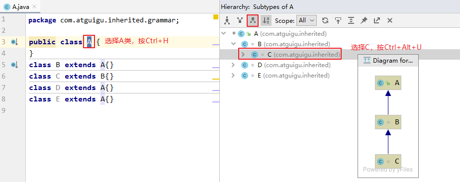
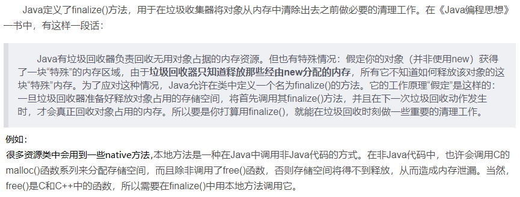
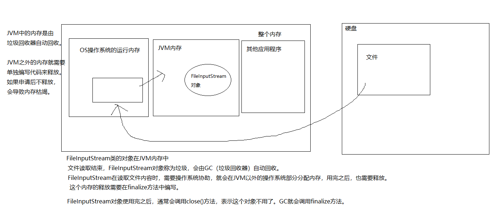
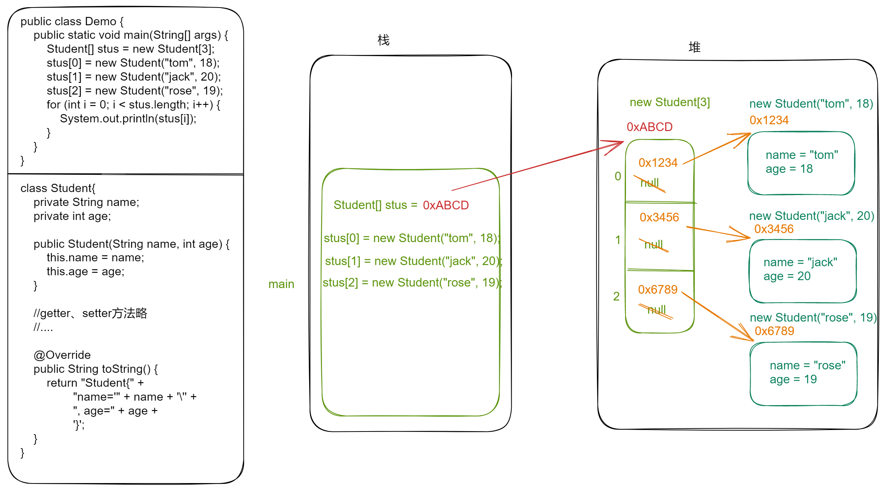

# 第7章【面向对象基础--中】

## 学习目标

* [ ] 理解继承
* [ ] 能够写出类的继承格式
* [ ] 能够说出继承的特点
* [ ] 能够说出方法重写的概念以及和重载的区别
* [ ] 能够使用this关键字解决问题
* [ ] 能够使用super关键字解决问题
* [ ] 能够应用多态解决问题
* [ ] 理解向上转型与向下转型
* [ ] 能够使用instanceof关键字判断对象类型
* [ ] 了解native关键字
* [ ] 掌握final关键字
* [ ] 掌握static关键字的用法
* [ ] 了解Object类的常用方法
* [ ] 会重写Object的常用方法
* [ ] 掌握权限修饰符的使用
* [ ] 理解对象数组

# 第七章 面向对象基础--中

## 7.1 继承（Inherit)

### 7.1.1 继承的概述

面向对象的三大特征：封装、继承、多态

1. #### 生活中的继承

   父辈的东西可以被孩子继承

   “子承父业”，“这孩子长得像妈妈”，“这个孩子跟爸爸一样有才华”

2. #### Java中的继承

   Java中有父类、子类的概念，类似生活中的父子关系，父类中的一些属性和方法可以被子类继承下来使用，不再需要重复定义。

   如图所示：

   

   多个类中存在相同属性和行为时，将这些内容抽取到单独一个类中，那么多个类中无需再定义这些属性和行为，只需要和抽取出来的类构成某种关系。如图所示：

   

   其中，多个类可以称为**子类**，也叫**派生类**；多个类抽取出来的这个类称为**父类**、**超类（superclass）**或者**基类**。

   继承描述的是事物之间的所属关系，这种关系是：`is-a` 的关系。例如，图中猫属于动物，狗也属于动物。可见，父类更通用，子类更具体。我们通过继承，可以使多种事物之间形成一种关系体系。

3. #### 继承的好处

   - 提高**代码的复用性**。
   - 提高**代码的扩展性**。
   - 类与类之间产生了关系，是学习**多态的前提**。
   
   > 弊端：增加了类与类之间的耦合度
   
    

### 7.1.2 继承的格式

通过 `extends` 关键字，可以声明一个子类继承另外一个父类，定义格式如下：

```java
【修饰符】 class 父类 {
	...
}

【修饰符】 class 子类 extends 父类 {
	...
}

```

继承演示，代码如下：

```java
/*
 * 定义动物类Animal，做为父类
 */
class Animal {
    // 定义name属性
	String name; 
    // 定义age属性
    int age;
	// 定义动物的吃东西方法
	public void eat() {
		System.out.println(age + "岁的" + name + "在吃东西");
	}
}

/*
 * 定义猫类Cat 继承 动物类Animal
 */
class Cat extends Animal {
	// 定义一个猫抓老鼠的方法catchMouse
	public void catchMouse() {
		System.out.println("抓老鼠");
	}
}

/*
 * 定义测试类
 */
public class ExtendDemo01 {
	public static void main(String[] args) {
        // 创建一个猫类对象
		Cat cat = new Cat()；
      
        // 为该猫类对象的name属性进行赋值
		cat.name = "Tom";
      
      	// 为该猫类对象的age属性进行赋值
		cat.age = 2;
        
        // 调用该猫的catchMouse()方法
		cat.catchMouse();
		
      	// 调用该猫继承来的eat()方法
      	cat.eat();
	}
}

演示结果：
抓老鼠
2岁的Tom在吃东西
```

### 7.1.3 继承的特点

#### 1、子类会继承父类所有的成员变量和方法

从类的定义来看，类是一类具有相同特性的事物的抽象描述。父类是所有子类共同特征的抽象描述。而实例变量和实例方法就是事物的特征，那么父类中声明的实例变量和实例方法代表子类事物也有这个特征。

- 当子类对象被创建时，在堆中给对象申请内存时，就要看子类和父类都声明了什么实例变量，这些实例变量都要分配内存。
- 当子类对象调用方法时，编译器会先在子类模板中看该类是否有这个方法，如果没找到，会看它的父类甚至父类的父类是否声明了这个方法，遵循从下往上找的顺序，找到了就停止，一直到根父类都没有找到，就会报编译错误。

所以继承意味着子类的对象除了看子类的类模板还要看父类的类模板。


#### 2、子类无法直接使用父类的私有成员

子类虽会继承父类私有(private)的成员变量，但子类不能对继承的私有成员变量直接进行访问（也可以理解为私有的属性不能被继承，[官方文档中的说法](https://docs.oracle.com/javase/tutorial/java/IandI/subclasses.html)），可通过继承的公共的get/set方法进行访问。如图所示：


父类代码：

```java
package com.atguigu.inherited.modifier;

public class Person {
    private String name;
    private int age;

    public String getName() {
        return name;
    }

    public void setName(String name) {
        this.name = name;
    }

    public int getAge() {
        return age;
    }

    public void setAge(int age) {
        this.age = age;
    }

    public String getInfo(){
        return "姓名：" + name + "，年龄：" + age;
    }
}

```

子类代码：

```java
package com.atguigu.inherited.modifier;

public class Student extends Person {
    private int score;

    public int getScore() {
        return score;
    }

    public void setScore(int score) {
        this.score = score;
    }

    public String getInfo(){
//        return "姓名：" + name + "，年龄：" + age;
        //在子类中不能直接使用父类私有的name和age
        return "姓名：" + getName() + "，年龄：" + getAge();
    }
}

```

测试类代码：

```java
package com.atguigu.inherited.modifier;

public class TestStudent {
    public static void main(String[] args) {
        Student student = new Student();

        student.setName("张三");
        student.setAge(23);
        student.setScore(89);

        System.out.println(student.getInfo());
    }
}
```

IDEA在Debug模式下查看学生对象信息：


#### 3、Java只支持单继承

```java
public class A{}
class B extends A{}

//一个类只能有一个父类，不可以有多个直接父类。
class C extends B{} 	//ok
class C extends A，B...	//error
```

#### 4、Java支持多层继承

```java
class A{}
class B extends A{}
class C extends B{}
```

> 顶层父类是Object类。所有的类默认继承Object，作为父类。
>
> 子类和父类是一种相对的概念，例如，B类对于A来说是子类，但是对于C类来说是父类

#### 5、一个类可以同时拥有多个子类

```java
class A{}
class B extends A{}
class D extends A{}
class E extends A{}
```

### 7.1.4 super调用父类构造器

在继承关系中，子类不会继承父类的构造器，子类构造器可以通过**`super(【实参列表】)`**来调用父类构造器。

- 子类的每个构造器中默认隐藏`super()`,即默认调用父类的无参构造器。
- 子类构造器中可以显示使用`super(【实参列表】)`来调用父类无参或有参构造器，那么默认隐藏的`super()`不再存在。
- 如果父类没有无参构造，则必须在子类构造器中显示使用`super(实参列表)`来调用父类构造器。
- `super(【实参列表】)`只能出现在子类构造器的首行

**总之：使用子类任意构造器创建对象时，必须要直接或间接通过`super(【实参列表】)`先调用执行父类构造器。**

```java
package com.atguigu.constructor;

public class Employee {
    private String name;
    private int age;
    private double salary;

    public Employee() {
        System.out.println("父类Employee无参构造");
    }

    public Employee(String name, int age, double salary) {
        this.name = name;
        this.age = age;
        this.salary = salary;
        System.out.println("父类Employee有参构造");
    }

    public String getName() {
        return name;
    }

    public void setName(String name) {
        this.name = name;
    }

    public int getAge() {
        return age;
    }

    public void setAge(int age) {
        this.age = age;
    }

    public double getSalary() {
        return salary;
    }

    public void setSalary(double salary) {
        this.salary = salary;
    }

    public String getInfo(){
        return "姓名：" + name + "，年龄：" + age +"，薪资：" + salary;
    }
}

```

```java
package com.atguigu.constructor;

public class Manager extends Employee{
    private double bonusRate;

    public Manager() {
        super();//可以省略
    }

    public Manager(String name, int age, double salary, double bonusRate) {
        super(name, age, salary);//调用父类的有参构造
        this.bonusRate = bonusRate;
    }

    public double getBonusRate() {
        return bonusRate;
    }

    public void setBonusRate(double bonusRate) {
        this.bonusRate = bonusRate;
    }

    @Override
    public String getInfo() {
        return super.getInfo() +"，奖金比例：" + bonusRate;
    }
}

```

```java
package com.atguigu.constructor;

public class TestEmployee {
    public static void main(String[] args) {
        Manager m1 = new Manager();
        System.out.println(m1.getInfo());

        Manager m2 = new Manager("张三",23,20000,0.1);
        System.out.println(m2.getInfo());
    }
}

```


### 7.1.5 IDEA中查看类的继承关系

例如：B类继承自A类，C类继承自B类

选择A类名，按`Ctrl + H`就会显示A类的继承树。

：A类的父类和子类

：A类的父类

：A类的所有子类

例如：在类继承目录树中选中某个类，比如C类，按Ctrl+ Alt+U就会用图形化方式显示C类的继承祖宗




## 7.2 方法重写（Override）

当子类继承了父类的某个方法之后，发现这个方法并不能满足子类的实际需求，那么可以通过方法重写，覆盖父类的方法。

### 7.2.1 什么是方法重写？

**子类中定义与父类中相同的方法，一般方法体不同，用于改造并覆盖父类的方法。**

代码示例：比如新的手机增加来电显示头像的功能

```java
class Phone {
	public void sendMessage(){
		System.out.println("发短信");
	}
	public void call(){
		System.out.println("打电话");
	}
	public void showNum(){
		System.out.println("来电显示号码");
	}
}

//智能手机类
class NewPhone extends Phone {
	
	//重写父类的来电显示号码功能，并增加自己的显示姓名和图片功能
	public void showNum(){
		//调用父类已经存在的功能使用super
		super.showNum();
		//增加自己特有显示姓名和图片功能
		System.out.println("显示来电姓名");
		System.out.println("显示头像");
	}
}

public class ExtendsDemo06 {
	public static void main(String[] args) {
      	// 创建子类对象
      	NewPhone np = new NewPhone()；
        
        // 调用父类继承而来的方法
        np.call();
      
      	// 调用子类重写的方法
      	np.showNum();

	}
}

```

> 小贴士：这里重写时，用到super.父类成员方法，表示调用父类的成员方法。

### 7.2.2 方法重写的具体要求

1. 必须保证父子类之间重写方法的名称相同。

2. 必须保证父子类之间重写方法的参数列表也完全相同。

2. 子类方法的返回值类型必须【小于等于】父类方法的返回值类型（小于其实就是是它的子类，例如：Cat< Animal）。

   > 注意：如果返回值类型是基本数据类型和void，那么必须是相同

3. 子类方法的权限必须【大于等于】父类方法的权限修饰符。

   > 注意：public > protected > 缺省 > private
   >
   > 父类私有方法不能重写
   >
   > 跨包的父类缺省的方法也不能重写

**另外:**

> 静态方法不能被重写，方法重写指的是实例方法重写，静态方法属于类的方法不能被重写，而是隐藏。
>
> final修饰的方法不能被重写

### 7.2.3 IDEA重写方法快捷键

快捷键:`Ctrl + O`


```java
package com.atguigu.inherited.method;

//smartphone：智能手机
public class Smartphone extends Phone{
    //重写父类的来电显示功能的方法
    public void showNum(){
        //来电显示姓名和图片功能
        System.out.println("显示来电姓名");
        System.out.println("显示头像");

        //保留父类来电显示号码的功能
        super.showNum();//此处必须加super.，否则就是无限递归，那么就会栈内存溢出
    }

    @Override
    public void call() {
        super.call();
        System.out.println("视频通话");
    }
}
```

> @Override：写在方法上面，用来检测是不是满足重写方法的要求。这个注解就算不写，只要满足要求，也是正确的方法覆盖重写。建议保留，这样编译器可以帮助我们检查格式，另外也可以让阅读源代码的程序员清晰的知道这是一个重写的方法。

**练习案例**

（1）父类Graphic图形
包含属性：name（图形名），属性私有化
包含求面积getArea()：返回0.0
求周长getPerimeter()方法：返回0.0
显示信息getInfo()方法：返回图形名称、面积、周长

（2）子类Circle圆继承Graphic图形
包含属性：radius
重写求面积getArea()和求周长getPerimeter()方法，显示信息getInfo()加半径信息

（3）子类矩形Rectange继承Graphic图形
包含属性：length、width
重写求面积getArea()和求周长getPerimeter()方法

```java
public class Graphic {
	private String name;

	public Graphic(String name) {
		super();
		this.name = name;
	}

	public String getName() {
		return name;
	}

	public void setName(String name) {
		this.name = name;
	}

	public double getArea() {
		return 0.0;
	}

	public double getPerimeter() {
		return 0.0;
	}

	/*
	 * this对象：调用当前方法的对象，如果是Graphic对象，那么就会执行Graphic的getArea()和getPerimeter()
	 * this对象：调用当前方法的对象，如果是Circle对象，那么就会执行Circle的getArea()和getPerimeter()
	 * this对象：调用当前方法的对象，如果是Rectangle对象，那么就会执行Rectangle的getArea()和getPerimeter()
	 */
	public String getInfo() {
		return "图形：" + name + "，面积：" + getArea() + ",周长：" + getPerimeter();
	}
}
```

```java
public class Circle extends Graphic {
	private double radius;

	public Circle(String name, double radius) {
		super(name);//super访问父类的构造器
		this.radius = radius;
	}

	public double getRadius() {
		return radius;
	}

	public void setRadius(double radius) {
		this.radius = radius;
	}

	@Override//表示这个方法是重写的方法
	public double getArea() {
		return Math.PI * radius * radius;
	}

	@Override//表示这个方法是重写的方法
	public double getPerimeter() {
		return Math.PI * radius * 2;
	}

	/*@Override//表示这个方法是重写的方法
	public String getInfo() {
		return super.getInfo() + "，半径：" + radius;
	}*/
	
}

```

```java
public class Rectangle extends Graphic {
	private double length;
	private double width;
	
	public Rectangle(String name, double length, double width) {
		super(name);
		this.length = length;
		this.width = width;
	}

	public double getLength() {
		return length;
	}

	public void setLength(double length) {
		this.length = length;
	}

	public double getWidth() {
		return width;
	}

	public void setWidth(double width) {
		this.width = width;
	}

	@Override
	public double getArea() {
		return length*width;
	}

	@Override
	public double getPerimeter() {
		return 2*(length + width);
	}
}

```

```java
public class TestGraphicExer3 {
	public static void main(String[] args) {
		Graphic g = new Graphic("通用图形");
		System.out.println(g.getInfo());
		
		Circle c = new Circle("圆", 1.2);
		System.out.println(c.getInfo());//调用getInfo()方法的对象是c
		
		Rectangle r = new Rectangle("矩形", 3, 5);
		System.out.println(r.getInfo());
	}
}
```


**练习**

1、声明父类：Person类
包含属性：姓名，年龄，性别
属性私有化，get/set
包含getInfo()方法：例如：姓名：张三，年龄：23，性别：男

2、声明子类：Student类，继承Person类
新增属性：score成绩
属性私有化，get/set
包含getInfo()方法：例如：姓名：张三，年龄：23，性别：男，成绩：89

3、声明子类：Teacher类，继承Person类
新增属性：salary薪资
属性私有化，get/set
包含getInfo()方法：例如：姓名：张三，年龄：23，性别：男，薪资：10000

```java
public class Person {
	private String name;
	private int age;
	private char gender;
	public Person(String name, int age, char gender) {
		super();
		this.name = name;
		this.age = age;
		this.gender = gender;
	}
	public Person() {
		super();
	}
	public String getName() {
		return name;
	}
	public void setName(String name) {
		this.name = name;
	}
	public int getAge() {
		return age;
	}
	public void setAge(int age) {
		this.age = age;
	}
	public char getGender() {
		return gender;
	}
	public void setGender(char gender) {
		this.gender = gender;
	}
	
	//包含getInfo()方法：例如：姓名：张三，年龄：23，性别：男
	public String getInfo(){
		return "姓名：" + name + "，年龄：" + age +"，性别：" + gender;
	}
}
```

```java
public class Student extends Person {
	private int score;

	public Student() {
	}

	public Student(String name, int age, char gender, int score) {
		setName(name);
		setAge(age);
		setGender(gender);
		this.score = score;
	}

	public int getScore() {
		return score;
	}

	public void setScore(int score) {
		this.score = score;
	}
	//包含getInfo()方法：例如：姓名：张三，年龄：23，性别：男，成绩：89
	public String getInfo(){
		//方式一：
//		return "姓名：" + getName() + "，年龄：" + getAge() + "，成绩：" + score;
		
		//方法二：
		return super.getInfo() + "，成绩：" + score;
	}
	
}
```

```java
public class Teacher extends Person {
	private double salary;

	public Teacher() {
	}

	public Teacher(String name, int age, char gender, double salary) {
		setName(name);
		setAge(age);
		setGender(gender);
		this.salary = salary;
	}

	public double getSalary() {
		return salary;
	}

	public void setSalary(double salary) {
		this.salary = salary;
	}
	
	//包含getInfo()方法：例如：姓名：张三，年龄：23，性别：男，薪资：10000
	public String getInfo(){
		return super.getInfo() + "，薪资：" + salary;
	}
}

```

```java
public class TestPersonExer2 {
	public static void main(String[] args) {
		Person p = new Person("张三", 23, '男');
		System.out.println(p.getInfo());
		
		Student s = new Student("李四", 25, '男', 89);
		System.out.println(s.getInfo());
		
		Teacher t = new Teacher("王五", 18, '男', 11111);
		System.out.println(t.getInfo());
	}
}
```

## 7.3 this和super关键字

### 7.3.1 this和super的应用场景与作用

- **this：表示当前对象**
  - 使用在构造器和非静态代码块中，表示正在new的对象

  - 使用在实例方法中，表示调用当前方法的对象


- **super：表示引用父类声明的成员**
  - 在构造器和实例方法中

无论是this和super都是和对象有关的（不能出现在静态域内）。

### 7.3.2 this和super的使用格式

- **this**
  - this.成员变量：表示当前对象的某个成员变量，而不是局部变量
  - this.成员方法：表示当前对象的某个成员方法，完全可以省略this.
  - this()或this(实参列表)：调用另一个构造器协助当前对象的实例化，只能在构造器首行，只会找本类的构造器，找不到就报错
- **super**
  - super.成员变量：表示当前对象的某个成员变量，该成员变量在父类中声明的
  - super.成员方法：表示当前对象的某个成员方法，该成员方法在父类中声明的
  - super()或super(实参列表)：调用父类的构造器协助当前对象的实例化，只能在构造器首行，只会找直接父类的对应构造器，找不到就报错

### 7.3.3 父、子类声明重名成员变量的问题

**<font color='red'>特别说明：应该避免子类声明和父类重名的成员变量</font>**

因为，子类会继承父类所有的成员变量，所以：

- 如果重名的成员变量表示相同的意义，就无需重复声明

- 如果重名的成员变量表示不同的意义，会引起歧义

在阿里的开发规范等文档中都做出明确说明：


**解决成员变量重名问题：**

- 如果实例变量与局部变量重名，可以在实例变量前面加this.进行区别
- 如果子类实例变量和父类实例变量重名，并且父类的该实例变量在子类仍然可见，在子类中要访问父类声明的实例变量需要在父类实例变量前加super.，否则默认访问的是子类自己声明的实例变量
- 如果父子类实例变量没有重名，只要权限修饰符允许，在子类中完全可以直接访问父类中声明的实例变量，也可以用this.实例访问，也可以用super.实例变量访问

```java
class Father{
	int a = 10;
	int b = 11;
}
class Son extends Father{
	int a = 20;
    
    public void test(){
		//子类与父类的属性同名，子类对象中就有两个a
		System.out.println("子类的a：" + a);//20  先找局部变量找，没有再从本类成员变量找
        System.out.println("子类的a：" + this.a);//20   先从本类成员变量找
        System.out.println("父类的a：" + super.a);//10    直接从父类成员变量找
		
		//子类与父类的属性不同名，是同一个b
		System.out.println("b = " + b);//11  先找局部变量找，没有再从本类成员变量找，没有再从父类找
		System.out.println("b = " + this.b);//11   先从本类成员变量找，没有再从父类找
		System.out.println("b = " + super.b);//11  直接从父类局部变量找
	}
	
	public void method(int a, int b){
		//子类与父类的属性同名，子类对象中就有两个成员变量a，此时方法中还有一个局部变量a		
		System.out.println("局部变量的a：" + a);//30  先找局部变量
        System.out.println("子类的a：" + this.a);//20  先从本类成员变量找
        System.out.println("父类的a：" + super.a);//10  直接从父类成员变量找

        System.out.println("b = " + b);//13  先找局部变量
		System.out.println("b = " + this.b);//11  先从本类成员变量找
		System.out.println("b = " + super.b);//11  直接从父类局部变量找
    }
}
class Test{
    public static void main(String[] args){
        Son son = new Son();
		son.test();
		son.method(30,13);  
    }
}
```

总结：起点不同（就近原则）

* **变量前面没有super.和this.**
  * 在构造器、代码块、方法中如果出现使用某个变量，先查看是否是当前块声明的**局部变量**，
  * 如果不是局部变量，先从当前执行代码的**本类去找成员变量**
  * 如果从当前执行代码的本类中没有找到，会往上找**父类声明的成员变量**（权限修饰符允许在子类中访问的）

* **变量前面有this.** 
  * 通过this找成员变量时，先从当前执行代码的**本类去找成员变量**
  * 如果从当前执行代码的本类中没有找到，会往上找**父类声明的成员变量**（权限修饰符允许在子类中访问的）

* **变量前面super.** 
  * 通过super找成员变量，直接从当前执行代码的直接父类去找成员变量（权限修饰符允许在子类中访问的）
  * 如果直接父类没有，就去父类的父类中找（权限修饰符允许在子类中访问的）

### 7.3.4 父、子类中方法重写后调用问题

- 如果子类没有重写父类的方法，只要权限修饰符允许，在子类中完全可以直接调用父类的方法；
- 如果子类重写了父类的方法，在子类中需要通过super.才能调用父类被重写的方法，否则默认调用的子类重写的方法

```java
public class Test1{
    public static void main(String[] args){
    	Son s = new Son();
    	s.test();
    	
    	Daughter d = new Daughter();
    	d.test();
    }
}
class Father{
	protected int num = 10;
	public int getNum(){
		return num;
	}
}
class Son extends Father{
	private int num = 20;
    
	public void test(){
		System.out.println(getNum());//10  本类没有找父类，执行父类中的getNum()
		System.out.println(this.getNum());//10  本类没有找父类，执行父类中的getNum()
		System.out.println(super.getNum());//10  本类没有找父类，执行父类中的getNum()
	}
}
class Daughter extends Father{
	private int num = 20;
    
    @Override
	public int getNum(){
		return num;
	}
    
	public void test(){
		System.out.println(getNum());//20  先找本类，执行本类的getNum()
		System.out.println(this.getNum());//20  先找本类，执行本类的getNum()
		System.out.println(super.getNum());//10  直接找父类，执行父类中的getNum()
	}
}
```

总结：

* **方法前面没有super.和this.**
  * 先从子类找匹配方法，如果没有，再从直接父类找，再没有，继续往上追溯

* **方法前面有this.**
  * 先从子类找匹配方法，如果没有，再从直接父类找，再没有，继续往上追溯

* **方法前面有super.**
  * 从当前子类的直接父类找，如果没有，继续往上追溯

## 7.4  Object类

### 7.4.1 如何理解根父类

类 `java.lang.Object`是类层次结构的根类，即所有类的父类。每个类都使用 `Object` 作为超类。

* Object类型的变量与除Object以外的任意引用数据类型的对象都多态引用
* 所有对象（包括数组）都实现这个类的方法。
* 如果一个类没有特别指定父类，那么默认则继承自Object类。例如：


```java
public class MyClass /*extends Object*/ {
  	// ...
}
```

### 7.4.2 native关键字(了解)

1. native的意义

   native：本地的，原生的

2. native的语法

   native只能修饰方法，表示这个方法的方法体代码不是用Java语言实现的，而是由C/C++语言编写的。但是对于Java程序员来说，可以当做Java的方法一样去正常调用它，或者子类重写它。

   JVM内存的管理：

   

   | 区域名称   | 作用                                                         |
   | ---------- | ------------------------------------------------------------ |
   | 程序计数器 | 程序计数器是CPU中的寄存器，它包含每一个线程下一条要执行的指令的地址 |
   | 本地方法栈 | 当程序中调用了native的本地方法时，本地方法执行期间的内存区域 |
   | 方法区     | 存储已被虚拟机加载的类信息、常量、静态变量、即时编译器编译后的代码等数据。 |
   | 堆内存     | 存储对象（包括数组对象），new来创建的，都存储在堆内存。      |
   | 虚拟机栈   | 用于存储正在执行的每个Java方法的局部变量表等。局部变量表存放了编译期可知长度的各种基本数据类型、对象引用，方法执行完，自动释放。 |

   

### 7.4.3 Object类的其中5个方法

​	**API(Application Programming Interface)**，应用程序编程接口。Java API是一本程序员的`字典` ，是JDK中提供给我们使用的类的说明文档。所以我们可以通过查询API的方式，来学习Java提供的类，并得知如何使用它们。在API文档中是无法得知这些类具体是如何实现的，如果要查看具体实现代码，那么我们需要查看**src源码**。

​	根据JDK源代码及Object类的API文档，Object类当中包含的方法有11个。今天我们主要学习其中的5个：

#### （1）hashCode()

public int hashCode()：返回每个对象的hash码值。根据对象内存地址换算得到的一个整数。

hashCode 的常规协定：

* 如果两个对象的hash值是不同的，那么这两个对象一定不相等；
* 如果两个对象的hash值是相同的，那么这两个对象不一定相等。


主要用于后面当对象存储到哈希表等容器中时，为了提高存储和查询性能用的。

```java
	public static void main(String[] args) {
		System.out.println("Aa".hashCode());//2112
		System.out.println("BB".hashCode());//2112
	}
```

#### （2）getClass()

public final Class<?> getClass()：获取对象的运行时类型

> 因为Java有多态现象，所以一个引用数据类型的变量的编译时类型与运行时类型可能不一致，因此如果需要查看这个变量实际指向的对象的类型，需要用getClass()方法

```java
	public static void main(String[] args) {
		Object obj = new String();
		System.out.println(obj.getClass().getName());//运行时类型
	}
```

讲反射时还会讲到它。

#### （3）toString()

public String toString()

①默认情况下，toString()返回的是“对象的运行时类型名称 @ 对象的hashCode值的十六进制形式"

②通常是建议重写

③如果我们直接System.out.println(对象)，默认会自动调用这个对象的toString()

> 因为Java的引用数据类型的变量中存储的实际上是对象的内存地址，但是Java对程序员隐藏内存地址信息，所以不能直接将内存地址显示出来，所以当你打印对象时，JVM帮你调用了对象的toString()。

例如自定义的Person类：

```java
public class Person {  
    private String name;
    private int age;

    @Override
    public String toString() {
        return "Person{" + "name='" + name + '\'' + ", age=" + age + '}';
    }

    // 省略构造器与Getter Setter
}
```

#### （4）equals()

public boolean equals(Object obj)：用于判断当前对象this与指定对象obj是否“相等”

①默认情况下，equals方法的实现等价于与“==”，比较的是对象的地址值

②我们一般选择重写，重写有些要求：

- 如果重写equals，那么一定要一起重写hashCode()方法，因为规定：
  - ​	如果两个对象调用equals返回true，那么要求这两个对象的hashCode值一定是相等的；
  - ​	如果两个对象的hashCode值不同的，那么要求这个两个对象调用equals方法一定是false；
  - ​	如果两个对象的hashCode值相同的，那么这个两个对象调用equals可能是true，也可能是false

- 如果重写equals，那么一定要遵循如下几个原则：
  - ​	自反性：x.equals(x)返回true
  - ​	传递性：x.equals(y)为true, y.equals(z)为true，然后x.equals(z)也应该为true
  - ​	一致性：只要参与equals比较的属性值没有修改，那么无论何时调用结果应该一致
  - ​	对称性：x.equals(y)与y.equals(x)结果应该一样
  - ​	非空对象与null的equals一定是false

```java
class User{
	private String host;
	private String username;
	private String password;
	public User(String host, String username, String password) {
		super();
		this.host = host;
		this.username = username;
		this.password = password;
	}
	public User() {
		super();
	}
	public String getHost() {
		return host;
	}
	public void setHost(String host) {
		this.host = host;
	}
	public String getUsername() {
		return username;
	}
	public void setUsername(String username) {
		this.username = username;
	}
	public String getPassword() {
		return password;
	}
	public void setPassword(String password) {
		this.password = password;
	}
	@Override
	public String toString() {
		return "User [host=" + host + ", username=" + username + ", password=" + password + "]";
	}
	@Override
	public int hashCode() {
		final int prime = 31;
		int result = 1;
		result = prime * result + ((host == null) ? 0 : host.hashCode());
		result = prime * result + ((password == null) ? 0 : password.hashCode());
		result = prime * result + ((username == null) ? 0 : username.hashCode());
		return result;
	}
	@Override
	public boolean equals(Object obj) {
		if (this == obj)
			return true;
		if (obj == null)
			return false;
		if (getClass() != obj.getClass())
			return false;
		User other = (User) obj;
		if (host == null) {
			if (other.host != null)
				return false;
		} else if (!host.equals(other.host))
			return false;
		if (password == null) {
			if (other.password != null)
				return false;
		} else if (!password.equals(other.password))
			return false;
		if (username == null) {
			if (other.username != null)
				return false;
		} else if (!username.equals(other.username))
			return false;
		return true;
	}
	
}
```

#### （5）finalize() 

protected void finalize()：用于最终清理内存的方法





演示finalize()方法被调用：

```java
public class TestFinalize {
	public static void main(String[] args) {
		for (int i = 0; i < 10; i++) {
			MyData my = new MyData();
             //每一次循环my就会指向新的对象，那么上次的对象就没有变量引用它了，就成垃圾对象
		}
		//通知垃圾回收器来回收垃圾
		System.gc();//为了看到垃圾回收器工作，让main方法不那么快结束，因为main结束就会导致JVM退出，GC也会跟着结束。
		
		try {
			Thread.sleep(2000);//等待2秒再结束main，为了看效果
		} catch (InterruptedException e) {
			e.printStackTrace();
		}
	}
}
class MyData{

	@Override
	protected void finalize() throws Throwable {
//        正常重写，这里是编写清理系统内存的代码
//        这里写输出语句是为了看到finalize()方法被调用的效果
		System.out.println("轻轻的我走了...");
	}
	
}
```

面试题：对finalize()的理解？

* 当对象被GC确定为要被回收的垃圾，在回收之前由GC帮你调用这个方法，不是由程序员手动调用。
* finalize方法的调用不一定会销毁当前对象，因为有可能在finalize()中写了让当前对象“复活”的代码

* 每一个对象的finalize方法只会被调用一次。

* 子类可以选择重写，一般用于彻底释放一些资源对象，而且这些资源对象往往时通过C/C++等代码申请的资源内存


重写toString、equals和hashCode方法的快捷方式（Alt+Insert）

建议使用IDEA中的Alt + Insert快捷键，而不是Ctrl + O快捷键。


## **7.5  对象数组**

**数组是用来存储一组数据的容器，一组基本数据类型的数据可以用数组装，那么一组对象也可以使用数组来装。**

**即数组的元素可以是基本数据类型，也可以是引用数据类型。当元素是引用数据类型时，我们称为对象数组。**

> **注意：对象数组，首先要创建数组对象本身，即确定数组的长度，然后再创建每一个元素对象，如果不创建，数组的元素的默认值就是null，所以很容易出现空指针异常NullPointerException。**

**示例：**

**①定义学生类Student，包含name和age属性，包含有参构造器和getter和setter方法，并重写toString方法**

**②在测试类中创建长度为3的Student[]数组，用来装3个学生对象，遍历数组显示每个对象的信息**

```java
public class Demo {
    public static void main(String[] args) {
        Student[] stus = new Student[3];
        stus[0] = new Student("tom", 18);
        stus[1] = new Student("jack", 20);
        stus[2] = new Student("rose", 19);
        for (int i = 0; i < stus.length; i++) {
            System.out.println(stus[i]);
        }
    }
}

class Student{
    private String name;
    private int age;

    public Student(String name, int age) {
        this.name = name;
        this.age = age;
    }

    @Override
    public String toString() {
        return "Student{" +
                "name='" + name + '\'' +
                ", age=" + age +
                '}';
    }
}
```

1. **对象数组的内存图分析**

   

**练习**

**（1）定义学生类Student**

​	**声明姓名和成绩实例变量，**

**（2）测试类ObjectArrayTest的main中创建一个可以装5个学生对象的数组，并且按照学生成绩排序，显示学生信息**


## 7.6  多态polymorphism

### 7.6.1 案例引入

多态是继封装、继承之后，面向对象的第三大特性。也是面向对象思想的核心。

我们通过代码先看一个案例，引入多态性这个重要特性。

定义一个Animal类

```java
public class Animal {
    //String name = "animal";
    public void eat(){
        System.out.println("动物吃饭");
    }
}
```

定义一个Dog类

```java
public class Dog extends Animal {//继承Animal类
    //String name = "dog";
    @Override
    public void eat() {
        System.out.println("狗啃骨头");
    }

}
```

定义一个Person类

```java
public class Person {
    //喂狗吃饭
   public void feed(Dog dog){
        dog.eat();
    }
}
```

测试类

```java
public class Test1 {
    public static void main(String[] args) {
        Person p=new Person();
        //测试人喂狗吃饭
        p.feed(new Dog());
    }
}
```

这时如果需要拓展功能，增加一个猫Cat类，让人喂Cat吃饭，应该如何做？

很简单，在Person类中增加喂猫的方法，那如果后期还要不断的增加新功能（新增各种动物类），就要不断增加Person类对应的方法。这里就出现了一个问题：违背了软件开发中的开闭原则（对修改关闭，对扩展开放），并且大量类同代码冗余，即每次新增的方法除了参数类型不同，其他都基本相同。

能不能用简单方式解决？可以。

只需要在Person类中定义一个类似的方法，参数为Animal，其他全舍去，这就是多态的应用。

```java
//修改后的Person类
public class Person {
    //喂动物吃饭
   public void feed(Animal animal){
        animal.eat();
    }
}
```

再次测试，功能正常，增加新的动物类测试，发现不需要修改Person类，功能依然正常。

### 7.6.2 什么是多态

生活中：一个事物在不同的条件下呈现不同的特征状态，如水在100度下呈液态，100度以上呈气态。

Java中的多态指的是什么？	

#### 1、多态的形式

Java规定父类类型的变量可以接收子类类型的对象，这一点从逻辑上也是说得通的。

```java
父类类型 变量名 = 子类对象;
```

> 父类类型：指子类继承的父类类型，或者实现的父接口类型。
>
> 所以说继承是多态的前提

```java
//多态的引用形式
Animal a = new Cat();//Cat对象也属于其父类Animal类型。猫也是一个动物。
```

#### 2、多态的表现

多态引用形式的具体表现：编译时类型与运行时类型不一致，编译时看左边的“父类”，运行时看右边的“子类”。

也就是我们常说的：编译看左边，运行看右边。

```java
public class Test {
    public static void main(String[] args) {
        // 多态形式，创建对象
        Animal a = new Cat();  
        // 编译时，a变量呈现Animal类型特征，即Animal类中有eat方法，a调用eat方法时编译才能成功
        a.eat();//运行时，实际执行的是Cat类中重写的eat方法。 
        
        //a1.catchMouse();//错误，编译时左边父类Animal中没有此方法，所以编译失败

        // 多态形式，创建对象
        a = new Dog(); 
        //运行时执行的是 Dog类中重写的eat方法
        a.eat();               
    }  
}
```

#### 3、多态的好处

运行时，看“子类”，如果子类重写了方法，一定是执行子类重写的方法；变量引用的子类对象不同，执行的方法就不同，实现动态绑定。代码编写更灵活、功能更强大，可维护性和扩展性更好了。

1. 提高程序的扩展性（参考引入案例分析）
2. 降低类与类之间的耦合度（参考引入案例分析）

### 7.6.3 多态的应用形式

#### 1、多态应用在成员变量和方法参数	

- 方法的形参是父类类型，调用方法的实参是子类对象
- 实例变量声明父类类型，实际存储的是子类对象

代码如下：

```java
public class OnePersonOnePet {
    private Pet pet;
    public void adopt(Pet pet) {//形参是父类类型，实参是子类对象
        this.pet = pet;
    }
    public void feed(){
        pet.eat();//pet实际引用的对象类型不同，执行的eat方法也不同
    }
}
```

```java
public class TestOnePersonOnePet {
    public static void main(String[] args) {
        OnePersonOnePet person = new OnePersonOnePet();

        Dog dog = new Dog();
        person.adopt(dog);//实参是dog子类对象，形参是父类Pet类型
        person.feed();

        Cat cat = new Cat();
        person.adopt(cat);//实参是cat子类对象，形参是父类Pet类型
        person.feed();
    }
}
```


#### 2、多态应用在数组

数组元素类型声明为父类类型，实际存储的是子类对象

```java
public class OnePersonManyPets {
    private Pet[] pets;//数组元素类型是父类类型，元素存储的是子类对象

    public void adopt(Pet[] pets) {
        this.pets = pets;
    }

    public void feed() {
        for (int i = 0; i < pets.length; i++) {
            pets[i].eat();//pets[i]实际引用的对象类型不同，执行的eat方法也不同
        }
    }
}
```

```java
public class TestPets {
    public static void main(String[] args) {
        Pet[] pets = new Pet[2];
        pets[0] = new Dog();//多态引用
        pets[1] = new Cat();//多态引用
        OnePersonManyPets person = new OnePersonManyPets();
        person.adopt(pets);
        person.feed();
    }
}
```

#### 3、多态应用在方法的返回值类型

```java
public class PetShop {
    //返回值类型是父类类型，实际返回的是子类对象
    public Pet sale(String type){
        switch (type){
            case "Dog":
                return new Dog();
            case "Cat":
                return new Cat();
        }
        return null;
    }
}
```

```java
public class TestPetShop {
    public static void main(String[] args) {
        PetShop shop = new PetShop();

        Pet dog = shop.sale("Dog");
        dog.eat();

        Pet cat = shop.sale("Cat");
        cat.eat();
    }
}
```

**练习1**

（1）声明父类Traffic，包含方法public void drive()
（2）声明子类Car,Bicycle等，并重写drive方法
（3）在测试类的main中创建一个数组，有各种交通工具，遍历调用drive()方法
模拟马路上跑的各种交通工具

```java
public class Traffic {
	public void drive(){
        System.out.println("~~~~");
    }
}
```

```java
public class Car extends Traffic {
	@Override
	public void drive() {
		System.out.println("滴滴滴...");
	}
}
```

```java
public class Bicycle extends Traffic {
	@Override
	public void drive() {
		System.out.println("蹬蹬蹬。。。");
	}
}
```

```java
public class TestExer1 {
	public static void main(String[] args) {
		//右边这些是用匿名对象，初始化数组
		Traffic[] arr = {new Car(),new Bicycle(),new Car(),new Bicycle()};
		for (int i = 0; i < arr.length; i++) {
			arr[i].drive();
		}
	}
}
```

**练习2**

1、声明一个父类Employee员工类型，有属性，姓名（String）
有方法，public double earning() 用于返回实发工资，默认返回0
		public String getInfo()：显示姓名和实发工资

2、声明一个子类SalaryEmployee正式工，继承父类Employee，增加属性，薪资，工作日天数，请假天数
重写方法，public double earning()返回实发工资，实发工资 = 薪资 - 薪资/工作日天数 * 请假天数，

3、声明一个子类HourEmployee小时工，继承父类Employee
有属性，工作小时数，每小时多少钱
重写方法，public double earning()返回实发工资， 实发工资 = 每小时多少钱 * 小时数

4、声明一个子类Manager经理，继承SalaryEmployee，增加属性：奖金比例
重写方法，public double earning()返回实发工资，实发工资 = (薪资 - 薪资/工作日天数 * 请假天数)*(1+奖金比例)

5、你现在是财务，需要查看每个人的实发工资，并查看工资总额。
声明一个员工数组，存储各种员工，并遍历显示他们的姓名和实发工资，并计算所有员工的工资总额

```java
public class Employee {
	private String name;

	public Employee(String name) {
		super();
		this.name = name;
	}

	public Employee() {
		super();
	}

	public String getName() {
		return name;
	}

	public void setName(String name) {
		this.name = name;
	}

	public double earning(){
        return 0.0;
    }

	public String getInfo() {
		return "姓名：" + name + "，实发工资：" + earning();
	}
}
```

```java
public class SalaryEmployee extends Employee {
	private double salary;
	private int workingDays;//工作日天数，
	private double offDays;//请假天数

	public SalaryEmployee() {
		super();
	}

	public SalaryEmployee(String name,  double salary, int workingDays, double offDays) {
		super(name);
		this.salary = salary;
		this.workingDays = workingDays;
		this.offDays = offDays;
	}

	public double getSalary() {
		return salary;
	}

	public void setSalary(double salary) {
		this.salary = salary;
	}

	public int getWorkingDays() {
		return workingDays;
	}

	public void setWorkingDays(int workingDays) {
		this.workingDays = workingDays;
	}

	public double getOffDays() {
		return offDays;
	}

	public void setOffDays(double offDays) {
		this.offDays = offDays;
	}

	/*
	 * 重写方法，public double earning()返回实发工资， 
		实发工资 = 薪资 - 薪资/工作日天数 * 请假天数
	 */
	@Override
	public double earning() {
		return salary - salary/workingDays * offDays;
	}

}
```

```java
public class HourEmployee extends Employee {
	private double moneyPerHour;
	private double hours;
	
	public HourEmployee() {
		super();
	}

	public HourEmployee(String name, double moneyPerHour, double hours) {
		super(name);
		this.moneyPerHour = moneyPerHour;
		this.hours = hours;
	}

	public double getMoneyPerHour() {
		return moneyPerHour;
	}

	public void setMoneyPerHour(double moneyPerHour) {
		this.moneyPerHour = moneyPerHour;
	}

	public double getHours() {
		return hours;
	}

	public void setHours(double hours) {
		this.hours = hours;
	}

	/*
	 * 重写方法，public double earning()返回实发工资， 
		实发工资 = 每小时多少钱 * 小时数	
	 */
	@Override
	public double earning() {
		return moneyPerHour * hours;
	}

}

```

```java
public class Manager extends SalaryEmployee {
	private double commisionPer;

	public Manager() {
		super();
	}

	public Manager(String name,  double salary, int workingDays, double offDays, double commisionPer) {
		super(name, salary, workingDays, offDays);
		this.commisionPer = commisionPer;
	}

	public double getCommisionPer() {
		return commisionPer;
	}

	public void setCommisionPer(double commisionPer) {
		this.commisionPer = commisionPer;
	}

	@Override
	public double earning() {
		return super.earning() * (1+commisionPer);
	}
}
```

```java
public class TestEmployee {
	public static void main(String[] args) {
		Employee[] all = new Employee[3];
		
		all[0] = new HourEmployee("张三", 50, 50);
		all[1] = new SalaryEmployee("李四", 10000, 22, 1);
		all[2] = new Manager("老王", 20000, 22, 0, 0.3);
		
		double sum = 0;
		for (int i = 0; i < all.length; i++) {
			System.out.println(all[i].getInfo());
			sum += all[i].earning();
		}
		System.out.println("总额：" + sum);
	}
}
```


### 7.6.4 向上转型与向下转型

首先，一个对象在new的时候创建是哪个类型的对象，它从头至尾都不会变。即这个对象的运行时类型，本质的类型用于不会变。但是，把这个对象赋值给不同类型的变量时，这些变量的编译时类型却不同。

这个和基本数据类型的转换是不同的。基本数据类型是把数据值copy了一份，相当于有两种数据类型的值。而对象的赋值不会产生两个对象。

**1、为什么要类型转换呢？**

因为多态，就一定会有把子类对象赋值给父类变量的时候，这个时候，<font color="red">**在编译期间**</font>，就会出现类型转换的现象。

但是，使用父类变量接收了子类对象之后，我们就**不能调用**子类拥有而父类没有的方法了。这也是多态给我们带来的一点"小麻烦"。所以，想要调用子类特有的方法，必须做类型转换，使得<font color='red'>**编译通过**</font>。

* **向上转型**：当左边的变量的类型（父类） > 右边对象/变量的类型（子类），我们就称为向上转型
  * 此时，编译时按照左边变量的类型处理，就只能调用父类中有的变量和方法，不能调用子类特有的变量和方法了
  * 但是，**运行时，仍然是对象本身的类型**，所以执行的方法是子类重写的方法体。
  * 此时，一定是安全的，而且也是自动完成的

* **向下转型**：当左边的变量的类型（子类）<右边对象/变量的编译时类型（父类），我们就称为向下转型
  * 此时，编译时按照左边变量的类型处理，就可以调用子类特有的变量和方法了
  * 但是，**运行时，仍然是对象本身的类型**
  * 不是所有通过编译的向下转型都是正确的，可能会发生ClassCastException，为了安全，可以通过isInstanceof关键字进行判断


**2、如何向上转型与向下转型**

**向上转型：子类类型转换为父类类型，自动完成**

**向下转型：父类类型转换为子类类型，语法格式:（子类类型）父类变量**

```java
package com.atguigu.polymorphism.grammar;

public class ClassCastTest {
    public static void main(String[] args) {
        //没有类型转换
        Dog dog = new Dog();//dog的编译时类型和运行时类型都是Dog

        //向上转型
        Pet pet = new Dog();//pet的编译时类型是Pet，运行时类型是Dog
        pet.setNickname("小白");
        pet.eat();//可以调用父类Pet有声明的方法eat，但执行的是子类重写的eat方法体
//        pet.watchHouse();//不能调用父类没有的方法watchHouse

        Dog d = (Dog) pet;
        System.out.println("d.nickname = " + d.getNickname());
        d.eat();//可以调用eat方法
        d.watchHouse();//可以调用子类扩展的方法watchHouse

        Cat c = (Cat) pet;//编译通过，因为从语法检查来说，pet的编译时类型是Pet，Cat是Pet的子类，所以向下转型语法正确
        //这句代码运行报错ClassCastException，因为pet变量的运行时类型是Dog，Dog和Cat之间是没有继承关系的
    }
}
```

**3、instanceof关键字**

`instanceof`关键字**用于判断一个对象的运行时类型**

为了避免`ClassCastException`的发生，Java提供了 `instanceof` 关键字，给引用变量做类型的校验，只要用`instanceof`判断返回true的，那么强转为该类型就一定是安全的，不会报`ClassCastException`异常。

格式：

```
变量/匿名对象 instanceof 数据类型 
```

那么，哪些`instanceof`判断会返回true呢？

- 变量/匿名对象的编译时类型 与  `instanceof`后面数据类型是直系亲属关系才可以比较
- 变量/匿名对象的运行时类型<= instanceof后面数据类型，才为true

示例代码：

```java
public class TestInstanceof {
    public static void main(String[] args) {
        Pet[] pets = new Pet[2];
        pets[0] = new Dog();//多态引用
        pets[1] = new Cat();//多态引用

        for (int i = 0; i < pets.length; i++) {
            pets[i].eat();

            if(pets[i] instanceof Dog){
                Dog dog = (Dog) pets[i];
                dog.lookDoor();
            }else if(pets[i] instanceof Cat){
                Cat cat = (Cat) pets[i];
                cat.catchMouse();
            }
        }
    }
}
```

**练习题**

1、声明一个父类Employee员工类型，
有属性，姓名（String），出生日期（MyDate类型，也是自定义的含年，月，日属性日期类型）
有方法，public  double earning()
		public String getInfo()：显示姓名和实发工资

2、声明一个子类SalaryEmployee正式工，继承父类Employee
增加属性，薪资，工作日天数，请假天数
重写方法，public double earning()返回实发工资， 实发工资 = 薪资 - 薪资/工作日天数 * 请假天数，
重写方法，public String getInfo()：显示姓名和实发工资，月薪，工作日天数，请假天数	

3、声明一个子类HourEmployee小时工，继承父类Employee
有属性，工作小时数，每小时多少钱
重写方法，public double earning()返回实发工资， 实发工资 = 每小时多少钱 * 小时数
重写方法，public String getInfo()：显示姓名和实发工资，时薪，工作小时数
增加方法，public void leave()：打印查看使用工具是否损坏，需要赔偿

4、声明一个子类Manager经理，继承SalaryEmployee
增加属性：奖金，奖金比例
重写方法，public double earning()返回实发工资， 实发工资 = (薪资 - 薪资/工作日天数 * 请假天数)*(1+奖金比例)
重写方法，public String getInfo()：显示姓名和实发工资，月薪，工作日天数，请假天数，奖金比例

5、声明一个员工数组，存储各种员工，
你现在是人事，从键盘输入当前的月份，需要查看每个人的详细信息。
如果他是正式工（包括SalaryEmployee和Manager），并且是本月生日的，祝福生日快乐，通知领取生日礼物。如果是HourEmployee显示小时工，就进行完工检查，即调用leave方法

```java
public abstract class Employee {
	private String name;
	private MyDate birthday;
	public Employee(String name, MyDate birthday) {
		super();
		this.name = name;
		this.birthday = birthday;
	}
	public Employee(String name, int year, int month, int day) {
		super();
		this.name = name;
		this.birthday = new MyDate(year, month, day);
	}
	public Employee() {
		super();
	}
	public String getName() {
		return name;
	}
	public void setName(String name) {
		this.name = name;
	}
	public MyDate getBirthday() {
		return birthday;
	}
	public void setBirthday(MyDate birthday) {
		this.birthday = birthday;
	}
	
	public abstract double earning();
	
	public String getInfo(){
		return "姓名：" + name + "，生日：" + birthday.getInfo() +"，实发工资：" + earning();
	}
}
```

```java
public class SalaryEmployee extends Employee {
	private double salary;
	private int workingDays;//工作日天数，
	private double offDays;//请假天数

	public SalaryEmployee() {
		super();
	}

	public SalaryEmployee(String name, int year, int month, int day, double salary, int workingDays, double offDays) {
		super(name, year, month, day);
		this.salary = salary;
		this.workingDays = workingDays;
		this.offDays = offDays;
	}

	public SalaryEmployee(String name, MyDate birthday, double salary, int workingDays, double offDays) {
		super(name, birthday);
		this.salary = salary;
		this.workingDays = workingDays;
		this.offDays = offDays;
	}

	public double getSalary() {
		return salary;
	}

	public void setSalary(double salary) {
		this.salary = salary;
	}

	public int getWorkingDays() {
		return workingDays;
	}

	public void setWorkingDays(int workingDays) {
		this.workingDays = workingDays;
	}

	public double getOffDays() {
		return offDays;
	}

	public void setOffDays(double offDays) {
		this.offDays = offDays;
	}

	/*
	 * 重写方法，public double earning()返回实发工资， 
		实发工资 = 薪资 - 薪资/工作日天数 * 请假天数
	 */
	@Override
	public double earning() {
		return salary - salary/workingDays * offDays;
	}
	
	@Override
	public String getInfo() {
		return super.getInfo() + "，月薪：" + salary + "，工作日：" + workingDays +"，请假天数：" + offDays;
	}
}
```

```java
public class HourEmployee extends Employee {
	private double moneyPerHour;
	private double hours;
	
	public HourEmployee() {
		super();
	}

	public HourEmployee(String name, int year, int month, int day, double moneyPerHour, double hours) {
		super(name, year, month, day);
		this.moneyPerHour = moneyPerHour;
		this.hours = hours;
	}

	public HourEmployee(String name, MyDate birthday, double moneyPerHour, double hours) {
		super(name, birthday);
		this.moneyPerHour = moneyPerHour;
		this.hours = hours;
	}

	public double getMoneyPerHour() {
		return moneyPerHour;
	}

	public void setMoneyPerHour(double moneyPerHour) {
		this.moneyPerHour = moneyPerHour;
	}

	public double getHours() {
		return hours;
	}

	public void setHours(double hours) {
		this.hours = hours;
	}

	/*
	 * 重写方法，public double earning()返回实发工资， 
		实发工资 = 每小时多少钱 * 小时数	
	 */
	@Override
	public double earning() {
		return moneyPerHour * hours;
	}

	@Override
	public String getInfo() {
		return super.getInfo() + "，时薪：" + moneyPerHour + "，小时数：" + hours;
	}

	public void leave(){
		System.out.println("小时工，查看使用工具是否损坏，需要赔偿，然后拿钱走人");
	}
}

```

```java
public class Manager extends SalaryEmployee {
	private double commisionPer;

	public Manager() {
		super();
	}

	public Manager(String name, int year, int month, int day, double salary, int workingDays, double offDays,
			double commisionPer) {
		super(name, year, month, day, salary, workingDays, offDays);
		this.commisionPer = commisionPer;
	}

	public Manager(String name, MyDate birthday, double salary, int workingDays, double offDays, double commisionPer) {
		super(name, birthday, salary, workingDays, offDays);
		this.commisionPer = commisionPer;
	}

	public double getCommisionPer() {
		return commisionPer;
	}

	public void setCommisionPer(double commisionPer) {
		this.commisionPer = commisionPer;
	}

	@Override
	public double earning() {
		return super.earning() * (1+commisionPer);
	}
	@Override
	public String getInfo() {
		return super.getInfo() + "，奖金比例：" + commisionPer;
	}
}

```

```java
public class TestEmployee {
	public static void main(String[] args) {
		Employee[] all = new Employee[3];
		/*all[0] = new HourEmployee("张三", new MyDate(1990, 5, 1), 50, 50);
		all[1] = new SalaryEmployee("李四", new MyDate(1991, 1, 1), 10000, 22, 1);
		all[2] = new Manager("老王", new MyDate(1987, 12, 8), 20000, 22, 0, 0.3);*/
		
		all[0] = new HourEmployee("张三", 1990, 5, 1, 50, 50);
		all[1] = new SalaryEmployee("李四", 1991, 1, 1, 10000, 22, 1);
		all[2] = new Manager("老王", 1987, 12, 8, 20000, 22, 0, 0.3);
		
		//从键盘输入当前的月份
		Scanner input = new Scanner(System.in);
		System.out.print("请输入当前月份：");
		int month;
		while(true){
			month = input.nextInt();
			if(month>=1 && month<=12){
				break;
			}
		}
		input.close();
		
		for (int i = 0; i < all.length; i++) {
			System.out.println(all[i].getInfo());
			if(all[i] instanceof SalaryEmployee){
				if(month == all[i].getBirthday().getMonth()){
					System.out.println(all[i].getName() +"生日快乐，领取生日补助购物卡");
				}
			}else{
				HourEmployee he = (HourEmployee) all[i];
				he.leave();
			}
		}
	}
}
```

### 7.6.5 虚方法(理解)

在Java中虚方法是指在编译阶段和类加载阶段都不能确定方法的调用入口地址，在运行阶段才能确定的方法，**即可能被重写的方法。**

当我们通过“对象.方法”的形式，调用一个虚方法，我们要如何确定它具体执行哪个方法呢？

- **静态分派**：先看这个对象的编译时类型，在这个对象的编译时类型中找到最匹配的方法,   最匹配的是指，实参的编译时类型与形参的类型最匹配
- **动态绑定：**再看这个对象的运行时类型，如果这个对象的运行时类重写了刚刚找到的那个最匹配的方法，那么执行重写的，否则仍然执行刚才编译时类型中的那个方法

> 成员变量和非虚方法不具有多态性。

示例：

```java
class MyClass{
	public void method(Father f) {
		System.out.println("father");
	}
	public void method(Son s) {
		System.out.println("son");
	}
}
class MySub extends MyClass{
	public void method(Father d) {
		System.out.println("sub--father");
	}
    public void method(Daughter d) {
		System.out.println("daughter");
	}
}
class Father{
	
}
class Son extends Father{
	
}
class Daughter extends Father{
	
}
```

```java
public class TestVirtualMethod {
    public static void main(String[] args) {
        MyClass my = new MySub();
        Father f = new Father();
        Son s = new Son();
        Daughter d = new Daughter();
        my.method(f);//sub--
            /*
            (1)静态分派：看my的编译时类型MyClass，在MyClass中找最匹配的
                匹配的原则：看实参的编译时类型与方法形参的类型的匹配程度
                 实参f的编译时类型是Father，形参(Father f) 、(Son s)
                 最匹配的是public void method(Father f)
            （2）动态绑定：看my的运行时类型MySub，看在MySub中是否有对    public void method(Father f)进行重写
                发现有重写，如果有重写，就执行重写的
                    public void method(Father d) {
                        System.out.println("sub--");
                    }
             */
        my.method(s);//son
            /*
            (1)静态分派：看my的编译时类型MyClass，在MyClass中找最匹配的
                匹配的原则：看实参的编译时类型与方法形参的类型的匹配程度
                 实参s的编译时类型是Son，形参(Father f) 、(Son s)
                 最匹配的是public void method(Son s)
            （2）动态绑定：看my的运行时类型MySub，看在MySub中是否有对 public void method(Son s)进行重写
                发现没有重写，如果没有重写，就执行刚刚父类中找到的方法
             */
        my.method(d);//sub--
             /*
            (1)静态分派：看my的编译时类型MyClass，在MyClass中找最匹配的
                匹配的原则：看实参的编译时类型与方法形参的类型的匹配程度
                 实参d的编译时类型是Daughter，形参(Father f) 、(Son s)
                 最匹配的是public void method(Father f)
            （2）动态绑定：看my的运行时类型MySub，看在MySub中是否有对 public void method(Father f)进行重写
                发现有重写，如果有重写，就执行重写的
                    public void method(Father d) {
                        System.out.println("sub--");
                    }
             */
    }
}
```

## 7.7 静态static

### 7.7.1 static关键字

在类中声明的实例变量，其值是每一个对象独立的。但是有些成员变量的值不需要或不能每一个对象单独存储一份，即有些成员变量和当前类的对象无关。

在类中声明的实例方法，在类的外面必须要先创建对象，才能调用。但是有些方法的调用和当前类的对象无关，那么创建对象就有点麻烦了。

此时，就需要将和当前类的对象无关的成员变量、成员方法声明为静态的（static）。

### 7.7.2 静态变量

#### 1、语法格式

有static修饰的成员变量就是静态变量。

```java
【修饰符】 class 类{
	【其他修饰符】 static 数据类型  静态变量名;
}
```

#### 2、静态变量的特点

- 静态变量的默认值规则和实例变量一样。
- 静态变量值是所有对象共享。

- 静态变量的值存储在方法区。
- 静态变量在本类中，可以在任意方法、代码块、构造器中直接使用。
- 如果权限修饰符允许，在其他类中可以通过“类名.静态变量”直接访问，也可以通过“对象.静态变量”的方式访问（但是更推荐使用类名.静态变量的方式）。
- 静态变量的get/set方法也静态的，当局部变量与静态变量重名时，使用“类名.静态变量”进行区分。

| 分类     | 数据类型                       | 默认值   |
| -------- | ------------------------------ | -------- |
| 基本类型 | 整数（byte，short，int，long） | 0        |
|          | 浮点数（float，double）        | 0.0      |
|          | 字符（char）                   | '\u0000' |
|          | 布尔（boolean）                | false    |
|          | 数据类型                       | 默认值   |
| 引用类型 | 数组，类，接口                 | null     |

演示：

```java
package com.atguigu.keyword;

public class Employee {
    private static int total;//这里私有化，在类的外面必须使用get/set方法的方式来访问静态变量
    static String company; //这里缺省权限修饰符，是为了演示在类外面演示“类名.静态变量”的方式访问
    private int id;
    private String name;

    {
        //两个构造器的公共代码可以提前到非静态代码块
        total++; 
        id = total; //这里使用total静态变量的值为id属性赋值
    }

    public Employee() {
    }

    public Employee(String name) {
        this.name = name;
    }

    public void setId(int id) {
        this.id = id;
    }

    public int getId() {
        return id;
    }

    public String getName() {
        return name;
    }

    public void setName(String name) {
        this.name = name;
    }

    public static int getTotal() {
        return total;
    }

    public static void setTotal(int total) {
        Employee.total = total;
    }

    @Override
    public String toString() {
        return "Employee{company = " + company + ",id = " + id + " ,name=" + name +"}";
    }
}
```

```java
package com.atguigu.keyword;

public class TestStaticVariable {
    public static void main(String[] args) {
        //静态变量total的默认值是0
        System.out.println("Employee.total = " + Employee.getTotal());

        Employee c1 = new Employee("张三");
        Employee c2 = new Employee();
        System.out.println(c1);//静态变量company的默认值是null
        System.out.println(c2);//静态变量company的默认值是null
        System.out.println("Employee.total = " + Employee.getTotal());//静态变量total值是2

        Employee.company = "尚硅谷";
        System.out.println(c1);//静态变量company的值是尚硅谷
        System.out.println(c2);//静态变量company的值是尚硅谷

        //只要权限修饰符允许,虽然不推荐，但是也可以通过“对象.静态变量”的形式来访问
        c1.company = "超级尚硅谷";

        System.out.println(c1);//静态变量company的值是超级尚硅谷
        System.out.println(c2);//静态变量company的值是超级尚硅谷
    }
}
```

#### 3、静态变量内存分析


#### 4、静态类变量和非静态实例变量、局部变量

|                | 静态变量                                   | **实例变量**                 | **局部变量**                                                 |
| -------------- | ------------------------------------------ | ---------------------------- | ------------------------------------------------------------ |
| **声明的位置** | 直接声明在类的成员位置                     | 直接声明在类的成员位置       | 声明在方法体中或其他局部区域内（方法声明上，构造方法，代码块等） |
| **修饰符**     | 必须static，还可以public、private、final等 | 可以public、private、final等 | 不能使用访问权限修饰符，可以使用final                        |
| **内存位置**   | **方法区**                                 | **堆**                       | **栈**                                                       |
| **初始化值**   | 有默认初始化值                             | 有默认初始化值               | 无默认初始化值                                               |
| **生命周期**   | 和类相同                                   | 同对象的生命周期             | 随着方法的调用而存在，方法调用完毕即消失                     |

### 7.7.3 静态方法

#### 1、语法格式

有static修饰的成员方法就是静态方法。

```java
【修饰符】 class 类{
	【其他修饰符】 static 返回值类型 方法名(形参列表){
        方法体
    }
}
```

#### 2、静态方法的特点

- 静态方法在本类的任意方法、代码块、构造器中都可以直接被调用。
- 只要权限修饰符允许，静态方法在其他类中可以通过“类名.静态方法“的方式调用。也可以通过”对象.静态方法“的方式调用（但是更推荐使用类名.静态方法的方式）。
- 静态方法可以被子类继承，但不能被子类重写。
- 静态方法的调用都只看编译时类型。

```java
package com.atguigu.keyword;

public class Father {
    public static void method(){
        System.out.println("Father.method");
    }

    public static void fun(){
        System.out.println("Father.fun");
    }
}
```

```java
package com.atguigu.keyword;

public class Son extends Father{
//    @Override //尝试重写静态方法，加上@Override编译报错，去掉Override不报错，但是也不是重写
    public static void fun(){
        System.out.println("Son.fun");
    }
}
```

```java
package com.atguigu.keyword;

public class TestStaticMethod {
    public static void main(String[] args) {
        Father.method();
        Son.method();//继承静态方法

        Father f = new Son();
        f.method();//执行Father类中的method
    }
}
```

### 7.7.4 静态和非静态的区别

#### 1、本类中的访问限制区别

- 静态直接访问静态，可以

- 非静态直接访问非静态，可以

- 非静态直接访问静态，可以

- 静态直接访问非静态，不可以

  一句话关于静态与非静态直接访问问题：**静态不能直接访问非静态**

#### 2、在其他类的访问方式区别

- 访问静态的类变量和静态的方法：
  - 通过“**类名.静态变量或方法**”的方式访问。（推荐）
  - 通过“**对象.静态变量或方法**"的方式访问。（不推荐）

- 访问非静态的实例变量和非静态的方法：
  - 只能通过“**对象.实例变量或方法**“方式访问。

#### 3、this和super的使用

**静态的方法等静态域中不允许出现this和super关键字**，如果有重名问题，使用“类名.”进行区别（this和super都是与对象相关）

非静态的方法等区域中，可以使用this和super关键字。

## 7.8 final关键字

#### 1.final的意义

final：最终的，不可更改的

#### 2.final修饰类

表示这个类不能被继承，没有子类

```java
final class Eunuch{//太监类
	
}
class Son extends Eunuch{//错误
	
}
```

#### 3.final修饰方法

表示这个方法不能被子类重写

```java
class Father{
	public final void method(){
		System.out.println("father");
	}
}
class Son extends Father{
	public void method(){//错误
		System.out.println("son");
	}
}
```

#### 4.final修饰变量

final修饰某个变量（成员变量或局部变量），表示它的值就不能被修改，即常量，常量名建议使用大写字母。

> 如果某个成员变量用final和static同时修饰后，那么必须对其直接显示赋值。
>
> 如果某个成员变量只使用final修饰后，必须在对象创建完成时完成对其初始化值（可以直接显式赋值、或在构造代码块中赋值，或在每个构造器中赋值）

```java
package com.atguigu.keyword.finals;

public class TestFinal {
    public static void main(String[] args){
        final int MIN_SCORE = 0;
        final int MAX_SCORE = 100;

        MyDate m1 = new MyDate();
        System.out.println(m1.getInfo());

        MyDate m2 = new MyDate(2022,2,14);
        System.out.println(m2.getInfo());
    }
}
class MyDate{
    //没有set方法,必须有显示赋值的代码
    private final int year;
    private final int month;
    private final int day;

    public MyDate(){
        year = 1970;
        month = 1;
        day = 1;
    }

    public MyDate(int year, int month, int day) {
        this.year = year;
        this.month = month;
        this.day = day;
    }

    public int getYear() {
        return year;
    }

    public int getMonth() {
        return month;
    }

    public int getDay() {
        return day;
    }

    public String getInfo(){
        return year + "年" + month + "月" + day + "日";
    }
}
```

## 7.9 四种权限修饰符（移至方法重写前）

权限修饰符共有4种，分别为public，protected、缺省、private；权限修饰符可以使得数据在一定范围内可见或者隐藏。

| 修饰符        | 本类 | 本包 | 其他包子类 | 任意位置 |
| ------------- | ---- | ---- | ---------- | -------- |
| **private**   | √    | ×    | ×          | ×        |
| **缺省**      | √    | √    | ×          | ×        |
| **protected** | √    | √    | √          | ×        |
| **public**    | √    | √    | √          | √        |

权限修饰符可以修饰：

外部类：public和缺省

成员变量、成员方法、构造器、成员内部类：public,protected,缺省,private

#### 1、外部类要跨包使用必须是public，否则仅限于本包使用

（1）外部类的权限修饰符如果缺省，本包使用没问题


（2）外部类的权限修饰符如果缺省，跨包使用有问题


#### 2、成员的权限修饰符问题

（1）本包下使用：成员的权限修饰符可以是public、protected、缺省


（2）跨包下使用：要求严格


（3）跨包使用时，如果类的权限修饰符缺省，成员权限修饰符>类的权限修饰符也没有意义


