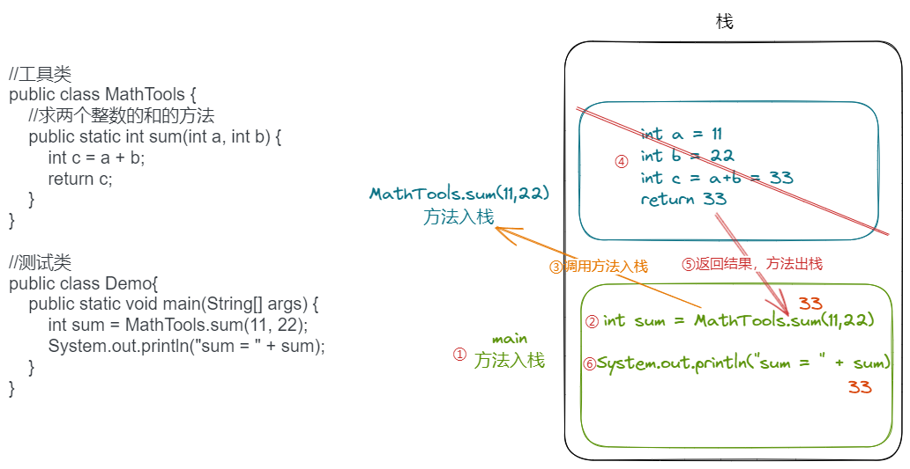

# 第5章 方法

## 学习目标

- [ ] 能够理解方法的作用
- [ ] 掌握方法的定义格式
- [ ] 掌握方法的调用方式
- [ ] 能够理解方法的调用执行机制
- [ ] 能够理解方法的参数传递机制
- [ ] 掌握方法的可变参数的使用
- [ ] 掌握方法重载的概念
- [ ] 能够判断出方法的重载
- [ ] 了解命令行参数

# 第五章 方法（Method）

## **5.1 方法的概念**

**方法也称为函数，是一段用来完成特定功能的代码片段，方法是一个类中最基本的功能单元。**

**把一个功能封装为方法的目的是，可以实现代码重用，从而简化代码，并且提高了代码的可读性，可维护性【版本迭代】**

## **5.2 成员方法的分类**

根据修饰不同方法主要分为两类：

* **静态方法：**有关键字static修饰的方法，也叫类方法。工具类中的方法通常都是静态方法。
* **实例方法：**没有static修饰的方法，必须通过实例对象来调用。（后面讲）

## 5.3 方法的声明

### 5.3.1 **方法声明的位置**

方法必须声明在类中，一个类中可以同时声明多个方法，每个方法声明是并列的关系，不能嵌套声明。

### 5.3.2 方法声明格式

方法声明的完整语法格式如下：(方括号内容表示可选项，根据实际需求决定是否需要)

```java
【修饰符】 返回值类型 方法名(【参数列表 】)【throws 异常列表】{
        方法体;
        【return 返回值;】
}
```

示例：

```java
public class Demo{
    //方法声明
    void sayHello(){
        System.out.println("hello method");
    }
}
```


### 5.3.3 方法声明格式说明及注意事项

1. 一个完整的方法包含声明部分（方法头）和功能实现部分（方法体）。
   - 大括号内为方法体，主要来实现功能；
   - 大括号之前的内容是方法头，也称为方法签名。通常使用（调用）方法时只关注方法头即可。
2. **修饰符：** 修饰符后面详细讲，例如：public，static等修饰符都可以修饰方法
3. **返回值类型：** 表示方法运行之后得到的数据的类型，如果希望方法运行后不产生任何数据，这里使用void。
4. **方法名：**给方法起的名字，属于标识符，命名遵循小驼峰发则，尽量见名知意，能准确代表该方法功能的名字
5. **参数列表：**如果的方法内部需要用到外部的数据，这时需要通过参数传递的形式将数据传递过来，根据需要可以传递一个或多个参数，也可以不传递参数。并且需要声明参数的类型。
6. throws 异常列表：可选，在异常章节再讲
7. **方法体：**具有特定功能的代码块
8. **return：**用于结束方法，通常用于返回数据。
     - ①**`return 返回值;`** return后跟数据，表示结束方法并将此数据作为方法的运行结果返回。
     - ②**`return;`**  单独使用时，仅用于结束方法。如果用在方法体最后，可以将其省略。
     - **注意**return后跟的数据必须与方法头上声明的**返回值类型**保持一致，如果方法声明的返回值类型为**void**，表示方法不能返回数据，即方法中不能使用return返回数据。


1. **示例：**

   ```java
   public class MethodDemo {
       
        /**
        * 1.无参无返回值方法的演示
        */
      static void sayHello(){
           System.out.println("hello Method ...");
       }
   
       /**
        * 2.有参无返回值方法的演示
        * 打印指定边长的正方形
        * @param n 参数n表示正方形的变长
        */
       static void printRectangle(int n) {
           for (int i = 0; i < n; i++) {
               for (int j = 0; j < n; j++) {
                   System.out.print("*");
               }
               System.out.println();
           }
       }
   
       /**
        * 3.无参有返回值方法的演示
        * 获取一个1到100之间的随机整数
        * @return 返回1-100之间的整数
        */
       static int getRandomInt() {
           return (int) (Math.random() * 100) + 1;
       }
       
       /**
        * 4.有参有返回值方法的演示
        * @param a int 第一个参数，要比较大小的整数之一
        * @param b int 第二个参数，要比较大小的整数之二
        * @return int 比较大小的两个整数中较大者的值
        */
       static int max(int a, int b){
           return a > b ? a : b;
       }
   }
   ```

## 5.4 方法的调用

**方法必须先声明后使用，不调用不执行，调用一次执行一次。**

### 5.4.1**方法的调用格式**

方法调用格式： **【类名.】静态方法(【实参列表】)** 

示例：

```java
/**
 * 方法调用案例演示
 */
public class MethodDemo {
    public static void main(String[] args) {
        //方法不调用不执行
        System.out.println("------------------方法调用演示--------------------");

        //1.调用无参无返回值方法
        MethodDemo.sayHello();//调用一次，执行一次
        sayHello();//调用一次，执行一次，因为是调用同一个类内部的方法，类名可以省略
        System.out.println("------------------------------------------------");
        //2.调用有参无返回值方法
        //必须传入实际参数，即实参。实参必须与方法声明上的参数（形参）一致（类型，个数，类型顺序一致）。
        printRectangle(3);

        System.out.println("------------------------------------------------");
        //3.调用无参有返回值方法
        //返回值可以使用相应类型的变量接收，也可以直接输出。否则返回值将丢失
        getRandomInt();//执行方法，返回值将丢失
        int num = getRandomInt();//先执行方法，然后使用变量接收方法的返回值
        System.out.println("num = " + num);
        System.out.println(getRandomInt());//先执行方法，然后直接输出方法的返回值

        System.out.println("------------------------------------------------");
        //4.调用有参有返回值的方法
        //实参与形参保持一致
        int max = max(12, 5);//方法返回值使用变量接收
        System.out.println("max = " + max);
    }
}

```

### 5.4.2 形参与实参

- **形参：**在定义方法时方法名后面括号中声明的变量称为形式参数（简称形参）即形参出现在方法定义时。

- **实参：**调用方法时方法名后面括号中的使用的值/变量/表达式称为实际参数（简称实参）即实参出现在方法调用时。

### 5.4.3 方法调用的注意事项

1. 调用方法时，实参的个数、类型、顺序必须要与形参列表一一对应

2. 调用方法时，如果方法有返回值，可以用与返回值类型相同的变量接受或直接处理返回值结果；

   如果方法的返回值类型是void，表示方法不能有返回值，即不能使用变量接收和直接处理方法执行结果。

3. 方法调用表达式的结果可以不接收和处理，方法调用表达式直接加`;`成为一个独立的语句，这种情况，返回值将丢失。

4. 在另一个类中调用当前类的方法，必须通过**`类名.方法名(实参列表)`**来调用，不可省略类名。

5. 多个方法之间可以相互调用，即在一个方法体内可以调用另一个方法。注意多个方法不能嵌套声明。


### 练习

1. 定义一个方法，求两个小数的和
2. 定义一个方法，可以求任意一个int数组的元素之和
3. 定义一个方法，可以对任意一个int数组进行排序（冒泡排序）

## 5.5 方法调用内存分析

**方法不调用不执行，调用一次执行一次，每次调用会在栈中有一个入栈动作，即给当前方法开辟一块独立的内存区域，用于存储当前方法的局部变量的值，当方法执行结束后，会释放该内存，称为出栈，如果方法有返回值，就会把结果返回调用处，如果没有返回值，就直接结束，回到调用处继续执行下一条指令。**

**栈结构特点：先进后出，后进先出。**

**示例代码：**

```java
public class MathTools {
    //求两个整数的和
    public static int sum(int a, int b) {
        int c = a + b;
        return c;
    }
}
//测试类
class Demo{
    public static void main(String[] args) {
        int sum = MathTools.sum(11, 22);
        System.out.println("sum = " + sum);
    }
}
```




## **5.6 方法重载**Overload

**方法重载：同一个类中（本类声明的或继承自父类的）的方法，方法名相同，参数列表不同的情况，这就叫方法重载。**

**参数列表不同：指的是参数个数不同，数据类型不同，数据类型顺序不同。**

注意：与方法的返回值类型无关

案例：用重载实现：

（1）定义方法求两个整数的和

（2）定义方法求三个整数的和

（3）定义方法求两个小数的和

（4）定义方法求一个小数与一个整数的和

```java
package com.atguigu.test06.overload;

public class MathTools {
    //求两个整数的和
    public static int sum(int a,int b){
        return a+b;
    }

    //求两个小数的和
    public static double sum(double a, double b){
        return a+b;
    }

    //求三个整数的和
    public static int sum(int a, int b, int c){
        return a+b+c;
    }
    
    //求一个小数与一个整数的和
    public static  double sum(double a, int b){
        return a+b;
    }
}
```

调用方法时，多个方法都匹配，找最匹配的方法来调用。

```java
package com.atguigu.test06.overload;
//测试类
public class DemoMathTools {
    public static void main(String[] args) {
        System.out.println(MathTools.sum(1, 3));
        System.out.println(MathTools.sum(1, 3, 8));
        System.out.println(MathTools.sum(1.7, 2.5));
        System.out.println(MathTools.sum(1.7, 2));
        System.out.println(MathTools.sum(1, 2.5));
    }
}
```


## **5.7  可变参数**

**在JDK1.5之后，如果我们定义一个方法时，此时某个形参的类型可以确定，但是形参的个数不确定，那么我们可以使用可变参数。**

**格式：**

```
【修饰符】 返回值类型 方法名(【非可变参数部分的形参列表,】参数类型... 形参名){  }
```

注意：

（1）一个方法最多只能有一个可变参数

（2）如果一个方法包含可变参数，那么可变参数必须是形参列表的最后一个

1. **示例一：    求n个整数的和**

   ```java
   public class MathTools{
   	// 完成数组 所有元素的求和
   	// 原始写法
   	public static  int getSum1(int[] arr) {
   		int sum = 0;
   		for (int i = 0; i < arr.length; i++) {
   			sum += arr[i];
   		}
   
   		return sum;
   	}
   
   	// 可变参数写法
   	public static int getSum2(int... arr) {
   		int sum = 0;
   		for (int i = 0; i < arr.length; i++) {
   			sum += arr[i];
   		}
   		return sum;
   	}
   }
   ```

   ```java
   //测试类
   public class Demo {
   	public static void main(String[] args) {
   		int[] arr = { 1, 4, 62, 431, 2 };
   		int sum1 = MathTools.getSum1(arr);
   		System.out.println(sum1);
   
   		int sum2 = MathTools.getSum2(arr);
   		System.out.println(sum2);
   		int sum3 = MathTools.getSum2(1, 4, 62, 431, 2);
   		System.out.println(sum3);
   	}
   }
   ```

   

2. **示例二：求1-n个整数中的最大值**

   ```java
   public class MathTools {
   	public static int max(int num, int... others){
   		int max = num;
   		for (int i = 0; i < others.length; i++) {
   			if(max < others[i]){
   				max = num;
   			}
   		}
   		return max;
   	}
   }
   ```

3. **示例三：字符串拼接**

   **n个字符串进行拼接，每一个字符串之间使用某字符进行分割，如果没有传入字符串，那么返回空字符串""**

   ```java
   public class StringTools {
       String concat(char seperator, String... args){
           String str = "";
           for (int i = 0; i < args.length; i++) {
               if(i==0){
                   str += args[i];
               }else{
                   str += seperator + args[i];
               }
           }
           return str;
       }
   }
   //测试类
   public class StringToolsTest {
       public static void main(String[] args) {
   
           System.out.println(StringTools.concat('-'));
           System.out.println(StringTools.concat('-',"hello"));
           System.out.println(StringTools.concat('-',"hello","world"));
           System.out.println(StringTools.concat('-',"hello","world","java"));
       }
   }
   ```

4. **可变参数的方法重载问题**

   求n个整数的最大值

   ```java
    //求n整数的最大值
       public int max(int... nums) {
           int max = nums[0];//如果没有传入整数，或者传入null，这句代码会报异常
           for (int i = 1; i < nums.length; i++) {
               if (nums[i] > max) {
                   max = nums[i];
               }
           }
           return max;
       }
   
   /*    //求n整数的最大值
       public int max(int[] nums){  //编译就报错，与(int... nums)无法区分
           int max = nums[0];//如果没有传入整数，或者传入null，这句代码会报异常
           for (int i = 1; i < nums.length; i++) {
               if(nums[i] > max){
                   max = nums[i];
               }
           }
           return max;
       }*/
   
       //求n整数的最大值
       public int max(int first, int... nums) {  //当前类不报错，但是调用时会引起多个方法同时匹配
           int max = first;
           for (int i = 0; i < nums.length; i++) {
               if (nums[i] > max) {
                   max = nums[i];
               }
           }
           return max;
       }
   ```


## 5.8 方法参数的值传递机制

**方法的参数传递机制：实参给形参赋值，那么反过来形参会影响实参吗？**

* **方法的形参是基本数据类型时，形参值的改变不会影响实参；**
* **方法的形参是引用数据类型时，形参地址值的改变不会影响实参，但是形参地址值里面的数据的改变会影响实参，例如，修改数组元素的值，或修改对象的属性值。**
  * **注意：String、Integer等特殊类型容易错**

**1、形参是基本数据类型**

案例：编写方法，交换两个整型变量的值

```java
package com.atguigu.test05.param;

public class PrimitiveTypeParam {
    public static void swap(int a, int b){//交换两个形参的值
        int temp = a;
        a = b;
        b = temp;
    }

    public static void main(String[] args) {
        int x = 1;
        int y = 2;
        System.out.println("交换之前：x = " + x +",y = " + y);//1,2
        swap(x,y);//实参x,y是基本数据类型，给形参的是数据的“副本”，调用完之后，x与y的值不变
        System.out.println("交换之后：x = " + x +",y = " + y);//1,2
    }
}
```

**2、形参是数组(引用数据类型)**

```java
package com.atguigu.test05.param;

public class MyArrayTools {
    //对数组进行冒泡排序的方法
   public static void sort(int[] arr){
        for (int i = 0; i < arr.length-1; i++) {
            for (int j = 0; j < arr.length - i - 1; j++) {
                if(arr[j] > arr[j+1]){
                    int temp = arr[j];
                    arr[j] = arr[j+1];
                    arr[j+1] = temp;
                }
            }
        }
    }
	//遍历数组的方法
    public static void iterate(int[] arr){
        for (int i = 0; i < arr.length; i++) {
            System.out.print(arr[i]+" ");
        }
        System.out.println();
    }

    public static void main(String[] args) {
        int[] nums = {4,3,1,6,7};
        System.out.println("排序之前：");
        //调用对数组遍历的方法
        iterate(nums);//实参nums把数组的首地址给形参arr，这个调用相当于输出nums数组的元素，对数组的元素值没有影响
		//调用对数组排序的方法
        sort(nums);//对nums数组元素位置进行了修改

        System.out.println("排序之后：");
        //调用对数组遍历的方法
        tools.iterate(nums);//输出nums数组的元素
        //上面的代码，从头到尾，堆中只有一个数组，没有产生新数组，无论是排序还是遍历输出都是同一个数组
    }
}
```


## **5.9 命令行参数（了解）**

**通过命令行给main方法的形参传递的实参称为命令行参数**

****

```java
public class TestCommandParam{
	//形参：String[] args
	public static void main(String[] args){
		System.out.println(args);
		System.out.println(args.length);
		
		for(int i=0; i<args.length; i++){
			System.out.println("第" + (i+1) + "个参数的值是：" + args[i]);
		}
	}
}
```

**命令行操作：**

```command
java TestCommandParam
```

```command
java TestCommandParam 1 2 3
```

```command
java TestCommandParam hello atguigu
```

**IDEA中操作：**

（1）配置运行参数


（2）运行程序


## **5.10 递归** Recursion（理解）

* **递归：指在当前方法内调用自己的这种现象。**
* **递归的分类:递归分为两种，直接递归和间接递归。**
  * **直接递归称为方法自身调用自己。**
  * **间接递归可以A方法调用B方法，B方法调用C方法，C方法调用A方法。**
* **注意事项：**
  * **递归一定要有条件限定，保证递归能够停止下来，否则会发生栈内存溢出。(无穷递归，类似死循环)**
  * **在递归中虽然有限定条件，但是递归次数不能太多。否则也会发生栈内存溢出。**


1. **示例一：计算1-100之间所有自然数的和**

   循环实现：

   ```java
   public class RecursionMethod1{
   	public static void main(String[] args) {
   		int sum = sum(100);
   		System.out.println("1-100的和：" + sum);
   	}
   
   	public static int sum(int n){
   		int sum=0;
           for(int i=1;i<=n;i++){
               sum+=i;
           }
           return sum;
   	}
   }
   ```

   递归实现：

   ```java
   public class RecursionMethod1{
   	public static void main(String[] args) {
   		int sum = sum(100);
   		System.out.println("1-100的和：" + sum);
   	}
   
   	public static int sum(int n){
   		if(n == 1){
   			return 1;
   		}else{
   			return n + sum(n-1);
   		}
   	}
   }
   ```

   递归的内存分析：

   ****

2. **示例二：求n!**

   ****

   ```java
   public class RecursionMethod2{
   	public static void main(String[] args) {
   		int jieCheng = jieCheng(10);
   		System.out.println("10的阶乘是：" + jieCheng);
   	}
   	public static int jieCheng(int n){
   		if(n <= 1){
   			return 1;
   		}else{
   			return n * jieCheng(n-1);
   		}
   	}
   }
   ```

3. **示例三：计算斐波那契数列（Fibonacci）的第n个值**

   **规律：一个数等于前两个数之和，**

   ​	**f(0) =1，**

   ​	**f(1) = 1，**

   ​	**f(2) = f(0) + f(1) =2，**

   ​	**f(3) = f(1) + f(2) = 3,** 

   ​	**f(4) = f(2) + f(3) = 5**

   ​	**...**

   ​	**f(n) = f(n-2) + f(n-1);**

   ```java
   public class RecursionMethod3{
   	public static void main(String[] args) {
   		Count c = new Count();
   		
   		System.out.println("f(10)：" + c.f(10));
   		System.out.println("f方法被调用的总次数：" + c.total);
   	}
   }
   class Count{
   	int total = 0;
   	public int f(int n){
   		total++;
   		if(n <= 1){
   			return 1;
   		}else{
   			return f(n-2) + f(n-1);
   		}
   	}
   }
   ```

   ****

4. #### **练习**

   描述：猴子吃桃子问题，

   猴子第一天摘下若干个桃子，当即吃了所有桃子的一半，还不过瘾，又多吃了一个。

   第二天又将仅剩下的桃子吃掉了一半，又多吃了一个。
   
   以后每天都吃了前一天剩下的一半多一个。
   
   到第十天，只剩下一个桃子。试求第一天共摘了多少桃子？
   
   
   
   

